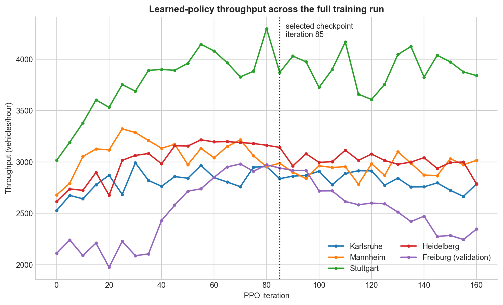

# GNN Traffic Signal Control

This research project trains a generalist graph-neural-network (GNN) traffic-signal controller across arbitrary cities derived from OpenStreetMap (OSM). A shared movement-level policy observes a heterogeneous graph of directed lane groups and legal turning movements, then selects one legal phase independently at each signalized junction. The aim is to learn reusable traffic-control behavior without fixing the number of intersections, the road topology, or the number of phases per junction.

## Approach

Each directed road corridor becomes a `LaneGroup` node and each legal turn through a signal becomes a `Movement` node. Typed message passing lets movements combine upstream demand with downstream capacity. The GNN outputs one score per movement; the controller sums the scores of the movements enabled by each candidate phase, masks phases that are temporarily illegal, and samples or selects a phase for each junction. SUMO remains responsible for minimum-green constraints, yellow transitions, and valid signal programs.

The city pipeline imports OSM, cleans and prunes malformed or infeasible junctions, builds movement-safe SUMO networks, and samples routes, demand, and initial occupancy. The same learned parameters operate across different graph sizes and phase counts. See the [architecture overview](docs/movement_architecture_overview.md), [PPO methodology](docs/ppo_training.md), and [OSM city pipeline](docs/city_osm_usage.md).

## Results

The strongest scratch-trained run used four rollout cities and treated Freiburg as held out from PPO rollout generation. The selected iteration-85 checkpoint was evaluated with sampled learned actions over six fixed seeds and a 1,200-step horizon. Throughput is vehicles/hour.

| city | split | learned | max pressure | queue |
| --- | --- | ---: | ---: | ---: |
| Karlsruhe | train | 2,837.5 | 2,870.0 | 2,714.5 |
| Mannheim | train | 2,987.5 | 3,260.5 | 3,294.0 |
| Stuttgart | train | 3,871.5 | 3,911.0 | 3,870.5 |
| Heidelberg | train | 3,141.5 | 3,026.5 | 2,684.5 |
| Freiburg | validation | 2,941.0 | 2,521.0 | 2,377.0 |

The defensible headline is: **a scratch-trained generalist GNN PPO controller reached or exceeded strong baselines on several OSM-derived cities and substantially outperformed them on the validation city at the selected checkpoint.** It did not beat every baseline in every city. Freiburg influenced checkpoint selection and is therefore a validation city, not an untouched final test set. Performance regressed after roughly iterations 70–85; the complete trajectory remains in the raw TensorBoard and logs.



Read the [full experiment report](docs/results/city_first_pass_throughput_scratch_32_worker.md) for completion, congestion, limitations, artifacts, and all plots.

## Getting Started

Install [uv](https://docs.astral.sh/uv/) and SUMO, then from the repository root:

```bash
uv sync --group dev
export SUMO_HOME=/usr/share/sumo
uv run python scripts/inspect_movement_city.py \
  --cfg configs/karlsruhe_oststadt/karlsruhe_oststadt.sumocfg \
  --time-to-teleport -1
```

Evaluate the selected checkpoint across all five configured cities:

```bash
uv run python scripts/eval_multi_city.py \
  --experiment-config configs/training/city_first_pass_throughput_scratch_32_worker.yaml \
  --checkpoint artifacts/ppo_runs/city_first_pass_throughput_progress_025_sample_eval_v3/selected_iteration_0085/movement_policy_iter_0085_best.pt \
  --output-dir reports/city_first_pass_iteration_0085
```

Start the same random-scratch PPO setup (32 rollout workers and libsumo are read from the experiment config):

```bash
uv run python scripts/train_rl.py \
  --experiment-config configs/training/city_first_pass_throughput_scratch_32_worker.yaml \
  --scratch-random \
  --scratch-lane-feature-dim 29 \
  --scratch-movement-feature-dim 4 \
  --scratch-hidden-dim 64 \
  --scratch-num-hops 1
```

PowerShell uses the same arguments with backticks for line continuation and `$env:SUMO_HOME = 'C:\\Program Files (x86)\\Eclipse\\Sumo'`. City generation and pruning are covered in [City / OSM usage](docs/city_osm_usage.md). The [documentation index](docs/README.md) separates current scientific documentation from operational and archived material.
