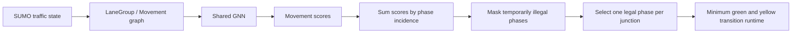
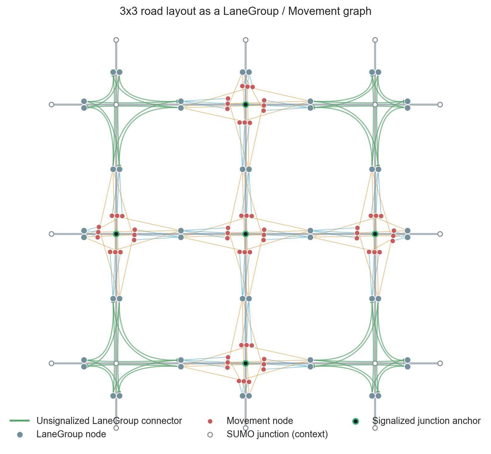
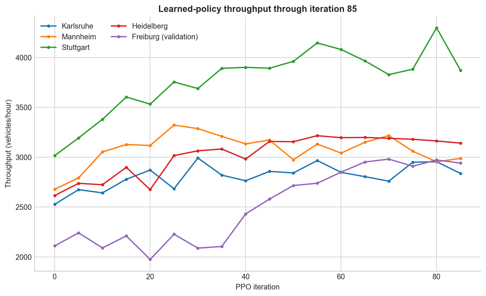

# GNN Traffic Signal Control

This research project trains a generalist graph-neural-network traffic-signal controller across arbitrary cities derived from OpenStreetMap (OSM). A shared movement-level policy observes directed road corridors and legal turns, then scores the legal phases at every signalized junction. The representation is independent of city size, road topology, and the number of phases at a junction.

## Architecture



`LaneGroup` nodes represent directed road corridors and carry queue, speed, occupancy, arrival, departure, and capacity information. `Movement` nodes represent legal turns through signalized junctions. Typed messages connect every movement to its input and output lane groups, allowing the same GNN parameters to combine upstream demand and downstream supply in every city.



The [interactive 3×3 movement graph](docs/assets/movement-graph-3x3.html) can switch layouts, hide explanatory layers, and inspect individual lane groups, movements, junctions, and message edges.
Green connector edges show lane-group-to-lane-group message flow through unsignalized junctions; blue and amber edges show signalized input and output movement relations.

See [Architecture and constraints](docs/architecture.md) for the exact graph and action semantics.

## Iteration-85 result

The strongest scratch-trained run used Karlsruhe, Mannheim, Stuttgart, and Heidelberg for PPO rollout generation. Freiburg generated no PPO rollouts and served as a topology-held-out validation city. The iteration-85 checkpoint was evaluated with sampled learned actions over six fixed seeds and a 1,200-decision-step horizon.

| city | split | learned | max pressure | queue |
| --- | --- | ---: | ---: | ---: |
| Karlsruhe | train | 2,837.5/h | 2,870.0/h | 2,714.5/h |
| Mannheim | train | 2,987.5/h | 3,260.5/h | 3,294.0/h |
| Stuttgart | train | 3,871.5/h | 3,911.0/h | 3,870.5/h |
| Heidelberg | train | 3,141.5/h | 3,026.5/h | 2,684.5/h |
| Freiburg | validation | 2,941.0/h | 2,521.0/h | 2,377.0/h |



The checkpoint beat both baselines in Heidelberg and Freiburg, was effectively tied with queue and close to max pressure in Stuttgart, was close to max pressure and above queue in Karlsruhe, and trailed both baselines in Mannheim. Freiburg was used during model development and is not an untouched final test set. See the [complete iteration-85 report](docs/results/city_first_pass_throughput_scratch_32_worker.md).

## Build a city and run the controller

Install [uv](https://docs.astral.sh/uv/), SUMO, and the project dependencies. On Linux:

```bash
uv sync --group dev
export SUMO_HOME=/usr/share/sumo
```

On PowerShell, set the equivalent SUMO location, for example:

```powershell
$env:SUMO_HOME = 'C:\Program Files (x86)\Eclipse\Sumo'
```

City configurations are produced by the network workbench. This command rebuilds Freiburg from its saved OSM/build/prune inputs, opens the pruning and graph inspection pages, verifies the result, and runs the configured GUI calibration step:

```powershell
uv run python scripts\network_workbench.py `
  --build-file configs\freiburg_altstadt\freiburg_altstadt.build.yaml `
  all
```

Once the city config exists, launch the selected checkpoint with the normal `run.py` defaults:

```powershell
uv run python scripts\run.py `
  --cfg configs\freiburg_altstadt\freiburg_altstadt.sumocfg `
  --method learned `
  --checkpoint artifacts\ppo_runs\city_first_pass_throughput_progress_025_sample_eval_v3\selected_iteration_0085\movement_policy_iter_0085_best.pt `
  --gui
```

The GUI runner displays the policy greedily by choosing the highest-scoring currently legal phase. The reported experiment evaluates the learned categorical policy by sampling legal phases. These are two explicit inference modes for the same checkpoint; the GUI command is intended for inspection rather than reproducing the result table.

To build a different OSM extract, tune pruning, or calibrate demand, follow [City pipeline](docs/city_pipeline.md). To collect imitation data, train from scratch, continue PPO from imitation learning, or evaluate checkpoints, follow [Training and evaluation](docs/training_and_evaluation.md).

## Documentation

- [Architecture and constraints](docs/architecture.md)
- [City-building pipeline](docs/city_pipeline.md)
- [Training and evaluation](docs/training_and_evaluation.md)
- [Iteration-85 results](docs/results/city_first_pass_throughput_scratch_32_worker.md)
- [Documentation index and archive policy](docs/README.md)
