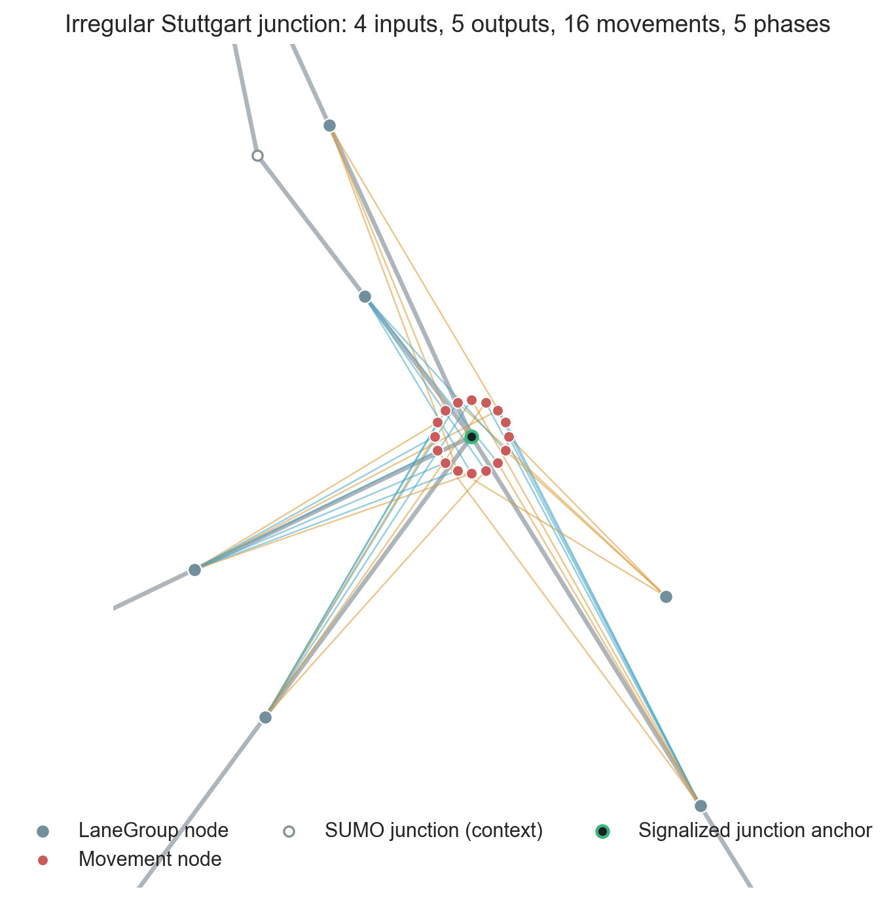

# Architecture and Constraints

## Control objective

The controller maps a SUMO traffic state to one legal target phase per signalized junction. It does not generate raw red/yellow/green strings. Network construction synthesizes compatible phases, and the runtime enforces minimum-green and transition rules around the policy's choices.

```text
traffic state
  -> LaneGroup / Movement graph
  -> shared message-passing GNN
  -> one score per Movement
  -> one summed logit per synthesized phase
  -> legal-action mask
  -> one phase decision per junction
```

## Graph nodes

### LaneGroup

A `LaneGroup` is a directed road corridor between controller-relevant endpoints. Opposite directions are different nodes. Unambiguous corridors through unsignalized junctions may be contracted into one lane group; contraction stops at branches where continuing would introduce a reachability shortcut.

Lane-group features describe the final detector region before the downstream junction and include:

- vehicle, moving-vehicle, and queue counts;
- occupancy, mean speed, detector saturation, and available storage;
- short- and long-window arrival and departure rates;
- moving vehicles and predicted arrivals approaching the queue tail;
- minimum and mean queue-tail ETA;
- corridor length, detector length, lane count, and speed limit.

Dynamic counts are normalized by detector capacity. A detector describes its observed region, not an unobserved full-road queue.

### Movement

A `Movement` is a legal signal-controlled turn from one input lane group to one output lane group through a specific traffic light. Movement nodes contain turn-local information such as demand, turn type, controlled-link count, and whether the movement was green at the previous decision.

Junctions are not GNN nodes. They own movements and selectable phases, but appear in visualizations only as spatial anchors.

## Typed message edges

Every movement has four directed message edges:

```text
input LaneGroup  -> Movement
output LaneGroup -> Movement
Movement         -> input LaneGroup
Movement         -> output LaneGroup
```

Message direction is not traffic direction. The output-to-movement edge carries downstream supply and spillback information back to the turn that would feed it.

One macro-hop is `Movement -> LaneGroup -> Movement`. It lets a movement observe immediately adjacent upstream and downstream movements. The reference checkpoint uses one macro-hop.

## Phase scoring

The GNN outputs one scalar score for every movement in the current city graph. For each junction, a phase-incidence matrix records which local movements receive green in each synthesized phase. Phase logits are sums over enabled movements:

```text
phase_logit[p] = sum(movement_score[m] for m enabled by phase p)
```

This reduction supports any number of movements and phases without changing the learned parameter shapes.

## Legal-action constraints

The selectable phase set already excludes incompatible movement combinations. At runtime, a Boolean action mask further removes phases that cannot be selected at that decision because of control state.

- A junction must satisfy its configured minimum green before switching.
- A switch may insert a deterministic yellow transition before the new green.
- A continued phase does not insert a transition.
- Pass-through or unsupported junctions are not policy decisions.
- Forced one-action decisions train the critic but do not contribute actor or entropy loss.
- Rollout collection and sampled learned-policy evaluation use the same legal-action mask.

The runtime asserts that an action allowed by PPO's mask is accepted by the signal controller. Illegal signal states are therefore excluded by construction rather than learned through penalties.

## Policy inference modes

PPO forms a categorical distribution over the legal phase logits. Training rollouts and the reference evaluation sample from that distribution. The interactive `scripts/run.py` path instead selects the highest-scoring legal phase for a stable visual demonstration. Results must state which inference mode was used.

## Cross-city generalization

The same feature definitions, typed message functions, movement scorer, and phase reduction are reused in every city. No learned city identity, fixed intersection index, fixed graph size, or global fixed phase count is required. A new city supplies a new graph and new per-junction phase-incidence matrices while retaining the learned parameters.

This is the intended generalization mechanism. Its effectiveness must still be evaluated empirically on topology-held-out cities and, for final claims, on fresh seeds and an unseen city that was not used for checkpoint selection.

## Visual examples


[Open the interactive 3×3 graph](assets/movement-graph-3x3.html).



The second image is deliberately cropped to expose an irregular local representation with four inputs, five outputs, 16 movements, and five phases. Blue edges carry input-lane information into movements; amber edges connect movement choices with output-lane supply.
