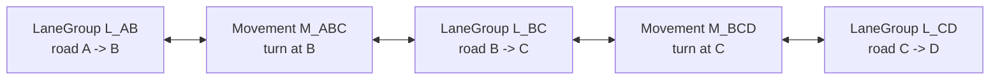
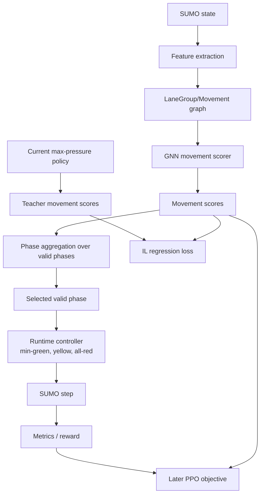

# Movement-GNN Architecture Overview

The project trains a neural controller for signalized traffic networks. The controller should eventually improve over deterministic baselines such as max pressure and queue-based control by reducing waiting time, queueing, spillback, and travel time while increasing throughput.

The learned model does **not** generate arbitrary signal states. It only scores legal movements. Valid phases, phase transitions, minimum-green constraints, yellow phases, and illegal-state prevention remain handled by the deterministic controller.

## Core Decision

The learned policy is movement-centric.

```text
network state -> LaneGroup/Movement graph -> GNN -> movement scores
movement scores + valid phases -> phase scores -> selected valid phase
```

A valid phase is a set of compatible movements produced by the existing phase synthesis code. A phase score is computed from the scores of the movements it enables, initially by summing movement scores.

## Graph Abstraction

The learning graph has two node types:

- `LaneGroup`: a directed road segment between two signalized junctions.
- `Movement`: a legal signal-controlled flow from one `LaneGroup` into another.

There are no signal/intersection nodes in the GNN for the initial design.

A directed road between intersections `A` and `B` creates separate lane groups:

```text
L_AB = traffic from A to B
L_BA = traffic from B to A
```

These are separate nodes because they have separate queues, speeds, occupancy, demand, lane counts, and rush-hour behavior.

A movement at junction `B` from `L_AB` into `L_BC` is represented as:

```text
M_ABC = movement from L_AB to L_BC through junction B
```

## Main Graph Structure



The graph naturally alternates:

```text
LaneGroup <-> Movement <-> LaneGroup <-> Movement <-> LaneGroup
```

Continuation through a signalized junction is represented by its controlled
Movement nodes. Unambiguous directed road corridors through unsignalized
junctions are contracted into one LaneGroup. Branches select a unique straight
continuation when available; otherwise contraction stops rather than creating
reachability shortcuts.

Contracted LaneGroups retain their ordered SUMO edge IDs. Static features sum
length and free-flow travel time, derive effective speed from those totals, and
aggregate lane storage in lane-metres. Dynamic detector features cover the
downstream 200 metres of the complete corridor, including multiple edges when
needed.

No explicit conflict edges are needed in the first version because valid phase synthesis already prevents illegal combinations.

## Interactive Graph Inspection

Generate the current movement graph visualization with:

```powershell
python scripts\visualize_movement_graph.py --open
```

The SUMO-map layout places junction anchors at their network coordinates,
directed LaneGroup nodes between their edge endpoints, and Movement nodes
around the signalized junction that owns them. The relaxed layout applies
repulsion between junction anchors and springs along SUMO roads.

Junction anchors, unsignalized junctions, and gray road lines are explanatory
overlays, not GNN nodes. Blue and amber connections show the bidirectional typed
message edges between input/output LaneGroups and Movements. Signalized labels
also display selectable phase count; this is distinct from movement-node count.

## Edge Semantics

For each movement `M_ABC`, the graph contains typed edges:

```text
input_lane_to_movement:   L_AB -> M_ABC
output_lane_to_movement:  L_BC -> M_ABC
movement_to_input_lane:   M_ABC -> L_AB
movement_to_output_lane:  M_ABC -> L_BC
```

Message direction is not the same as traffic direction. For example, downstream supply information from `L_BC` must flow into `M_ABC`, even though vehicles flow from `M_ABC` into `L_BC`.

## Message Passing

Zero-hop scoring uses only the movement itself plus its input and output lane groups.

One macro-hop is:

```text
Movement -> LaneGroup -> Movement
```

This lets a movement see immediately upstream and downstream neighboring movements.

Two macro-hops extend the context one more continuation step and are intended for corridor coordination and green-wave-like behavior.

Planned progression:

1. `0-hop` imitation learning: validate features, indexing, targets, and phase aggregation.
2. `1-hop` imitation learning: validate graph construction and message passing.
3. `1-hop` reinforcement learning: learn immediate upstream/downstream coordination.
4. `2-hop` reinforcement learning: test corridor coordination.
5. No `3-hop` model initially.

## Data Placement

Most sensor-like state belongs to `LaneGroup` nodes.

Recommended `LaneGroup` features:

- detector vehicle count;
- moving vehicle count;
- queue length;
- occupancy;
- mean speed;
- available storage proxy;
- arrival rate over 15 s;
- departure rate over 15 s;
- arrival rate over 60 s;
- departure rate over 60 s;
- detector saturation flag;
- length;
- detector length;
- number of lanes;
- speed limit.

Turn-specific state belongs to `Movement` nodes.

Recommended `Movement` features:

- oracle movement demand;
- normalized oracle movement demand;
- turn type;
- number of underlying SUMO controlled links;
- saturation-flow estimate if available;
- green at the previous controller decision.

For the first implementation, movement demand is allowed to use SUMO oracle information from routes/next links. Realistic turn-demand estimation from detectors, turn lanes, historical ratios, or camera assumptions is deferred.

Detector-local counts are computed from vehicle lane positions. A vehicle belongs
to a lane-group detector only when it is within the final
`min(200 m, lane-group length)` before the downstream junction. Moving count uses
SUMO's 0.1 m/s halting threshold, so an accelerating platoon remains explicitly
visible after its queue has cleared.

For a movement at junction A, the output LaneGroup is the road leaving A. Its
detector is at that road's downstream end, near junction B. The output feature
therefore observes the approach to B for spillback pressure; it is not a detector
immediately after A's stop line.

## Detector and Normalization Decision

Detector-based values must be normalized by detector capacity, not by full road capacity, because detector lengths may differ.

A 100 m detector cannot distinguish a 100 m queue from a 300 m queue once it is fully saturated. Therefore, detector-local features should explicitly mean “state of the observed detector region,” not “full road segment state.”

Use features such as:

```text
queue_norm_detector = queue_length_in_detector / detector_length
count_norm_detector = vehicle_count_in_detector / detector_capacity
detector_saturation = whether the detector appears fully queued
```

Static scale features such as full lane-group length, detector length, lane count, and speed limit should also be included so the model can interpret detector-local saturation in context.

## Training Split

There are two distinct learning stages.

### Imitation Learning

Imitation learning is supervised regression.

```text
features -> movement scores
target = current implemented max-pressure movement score
loss = Huber or MSE
```

The max-pressure teacher remains the initial behavioral target, but its raw
incoming and outgoing halting counts are not neural input columns. Otherwise IL
collapses to an exact subtraction and leaves the remaining representation
untrained. Training combines score regression with phase-ranking
cross-entropy, and traffic evaluation is required alongside the supervised
loss.

### Reinforcement Learning

RL starts only after imitation learning works.

The model still outputs movement scores. These are aggregated into phase logits:

```text
phase_logit(P) = sum(score(m) for m in movements enabled by P)
```

During PPO-style training, a valid phase is sampled from the softmax over phase logits. During deterministic evaluation, the selected phase is the argmax phase.

PPO is therefore not used for the supervised regression target. It is used later for discrete phase-action optimization after movement scores have been converted into phase logits.

## Training and Control Flow


