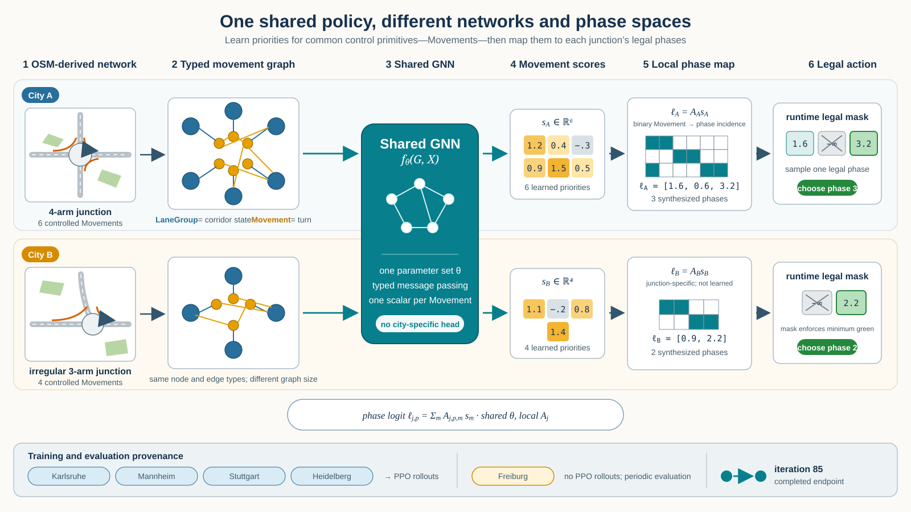

# Movement-Scoring Graph Policies for Traffic Signal Control Across Heterogeneous City Networks

> **First comprehensive draft.** Citation entries and claims marked **[CITATION TO VERIFY]** require comparison against the original publication before release. Table 2 is intentionally left pending rather than populated from estimates. Figure captions describe the intended final figures; several currently point to working repository assets.

## Abstract

Traffic-signal policies are difficult to reuse across road networks because intersections expose different movements and different numbers and definitions of legal phases. A conventional neural policy with a fixed phase-action head therefore binds learned output parameters to a particular action schema. We present a movement-level graph representation and control interface that separates network state, learned prioritization, and local action construction. Directed **LaneGroup** nodes encode traffic corridors, while **Movement** nodes encode legal signal-controlled turns between upstream and downstream LaneGroups. A shared typed graph neural network produces one scalar score per Movement. At each junction, a binary phase-incidence matrix sums the scores of Movements enabled by each locally synthesized phase, after which a runtime mask excludes temporarily unavailable actions. The selectable phases themselves are derived from SUMO controlled links and conflict information rather than assumed from a universal template. We trained the shared policy from scratch with PPO rollouts from four OSM-derived city scenarios and evaluated the final reported iteration-85 checkpoint on those cities and Freiburg, which generated no PPO rollouts. The learned controller was competitive with deterministic max-pressure and queue baselines in several rollout cities, exceeded both in Heidelberg, and achieved 2,941 vehicles/h in Freiburg compared with 2,521 and 2,377 vehicles/h for the baselines. These results are preliminary: they come from one training run, fixed development seeds, synthetic demand, and a validation city visible during development. The study therefore supports the feasibility of the representation and control interface rather than a conclusive generalization or state-of-the-art claim.

## 1. Introduction

Traffic-signal control is naturally a structured decision problem. A controller must respond to queues, arrivals, downstream storage, and interactions between nearby junctions, but it cannot select arbitrary combinations of green signals. Each junction has its own set of physically and operationally compatible movements. Consequently, a phase index does not have a stable meaning across intersections: action 0 at one junction may serve a pair of opposing through movements, whereas action 0 elsewhere may serve a protected turn. The number of valid actions can also change with junction geometry and phase construction.

This heterogeneity creates a basic obstacle for a generalist learned controller. A fixed neural output layer assigns separate learned weights to a fixed set of action indices. Applying that layer to a junction with a different number or definition of phases requires padding, canonical remapping, architectural modification, or a separately parameterized head. Such solutions can be appropriate, but they make the action representation—not only the observed traffic state—part of the transfer problem.

We instead treat movements as the shared control vocabulary. Across different junctions, a movement consistently means a legal signal-controlled turn from an incoming directed corridor to an outgoing directed corridor. The policy learns how desirable it is to release each movement, while the network definition determines which compatible movements can be served together. The resulting hierarchy is

\[
\text{corridor state}
\;\longrightarrow\;
\text{movement priority}
\;\longrightarrow\;
\text{compatible phase score}.
\]

The first step is represented by a heterogeneous city graph. Directed **LaneGroup** nodes carry upstream demand, queue, flow, speed, and storage information. **Movement** nodes represent signal-controlled input-to-output turns and connect the state of the incoming corridor to the supply of the outgoing corridor. Typed graph messages propagate information through controlled movements and through weighted connectors at unsignalized junctions. A shared graph neural network (GNN) then produces one scalar score for every Movement in the current graph.

The second step is deliberately simple. Each controllable junction supplies a binary matrix indicating which local Movements are enabled by each synthesized selectable phase. Multiplying this matrix by the local movement-score vector yields one logit per phase. Thus, the learned parameter shapes do not depend on city size, local movement count, or local phase count. Runtime state supplies a second Boolean mask that removes actions unavailable because a minimum-green constraint has not elapsed or a transition is in progress.

The local phase sets are not read directly from OpenStreetMap (OSM) signal tags. A reproducible construction workflow shapes an OSM extract and uses SUMO `netconvert` to derive lane-to-lane connections, controlled-link indices, request indices, and request-conflict information. Controlled links that must activate together become atomic groups. A compatibility graph is then constructed, and all maximal compatible sets are enumerated as selectable green phases. This connects the generic learned movement scores to the legal action space of each actual SUMO junction.

We study the following question:

> **Can a traffic-signal policy operate across road networks with different topology and phase structure by learning shared movement scores instead of network-specific phase actions?**

Our contributions are:

1. A city-level LaneGroup/Movement graph that separates directed corridor state from controllable turns and distinguishes signalized from unsignalized information paths.
2. A transparent structured policy interface in which a shared GNN ends at scalar Movement scores and non-learned local incidence matrices convert those scores into variable-size phase-action spaces.
3. An OSM-to-SUMO workflow that derives the Movement graph and selectable phases from controlled links and implemented conflict rules.
4. A preliminary multi-city experiment in which a scratch-trained PPO policy uses rollout data from Karlsruhe, Mannheim, Stuttgart, and Heidelberg and is additionally evaluated on Freiburg without Freiburg PPO rollouts.

The experiment is intended to demonstrate that this representation is operational and useful, not that it universally dominates strong traffic-control heuristics. At the final reported checkpoint, learned throughput exceeded both baselines in Heidelberg and Freiburg, was close to the strongest baseline in Karlsruhe and Stuttgart, and remained weaker in Mannheim. Freiburg is encouraging held-out-rollout evidence, but it was periodically evaluated during development and is not an untouched final test network.

**Figure 1: Shared movement-scoring control across heterogeneous networks (working figure).** Different city graphs contain different numbers of LaneGroups, Movements, and locally synthesized phases. The same parameterized GNN \(f_\theta\) produces one score per Movement. Junction-local incidence matrices aggregate these scores into differently sized phase-logit vectors, and runtime masks restrict selection to currently legal phases. Karlsruhe, Mannheim, Stuttgart, and Heidelberg generate PPO rollouts; Freiburg is evaluated without rollout generation.

## 2. Related work

### 2.1 Movement pressure and additive phase scoring

The closest conceptual lineage for additive Movement-to-phase scoring is max-pressure control. Max-pressure methods form movement or link priorities from an imbalance between upstream demand and downstream supply, then select a compatible stage that maximizes the aggregate pressure it serves. Varaiya established network-level stability properties for max-pressure control under the assumptions of the analyzed traffic model (Varaiya, 2013). PressLight translated max-pressure ideas into a reinforcement-learning formulation and emphasized pressure as a state or reward signal for coordinated traffic control (Wei et al., 2019a).

Our phase reduction follows the same broad compositional idea—score primitive traffic movements, then add the scores of movements served together—but replaces the hand-designed movement pressure with a score learned from a typed city graph. We do not claim that additive movement-to-phase aggregation is novel. The contribution is the particular representation and interface by which a shared GNN generates those scores for heterogeneous OSM-derived networks.

The deterministic max-pressure baseline in this study should also not be conflated with every controller covered by max-pressure theory. It is the repository's concrete heuristic operating over the same synthesized phase sets and runtime constraints as the learned controller. The theoretical guarantees of classical max pressure depend on traffic-model, observation, and control assumptions that are not established for these finite-horizon synthetic SUMO scenarios.

### 2.2 Movement- and phase-structured learned controllers

FRAP represents traffic demand through movements and models competition between phases in a symmetry-aware architecture (Zheng et al., 2019). It is especially relevant because it avoids treating phases as unrelated labels: phase demand is built from constituent movement features, and pairwise phase competition provides a structured inductive bias. Advanced-XLight later argued that expressive traffic-state representations, including pressure-oriented representations, can account for much of the performance attributed to increasingly elaborate reinforcement-learning designs (Zhang et al., 2022). These works reinforce the importance of choosing the state and action primitives carefully.

Our controller differs from a junction-local phase-value architecture in two ways. First, its message graph spans a city network and explicitly includes both controlled Movement nodes and unsignalized LaneGroup connectors. Second, the learned actor stops before a phase representation: it emits scalar Movement scores, and a fixed binary incidence operation constructs local phase logits. This makes the learned output independent of the number of phases without learning phase-specific embeddings or output weights.

CoLight uses graph attention to communicate among intersection agents and is an important example of network-level graph-based coordination (Wei et al., 2019b). Toward a Thousand Lights/MPLight studies parameter sharing and scalable decentralized control across large collections of traffic lights (Chen et al., 2020). These systems primarily motivate shared network control and learned communication. Our graph uses a finer LaneGroup/Movement representation: junctions own actions but are not themselves GNN nodes.

### 2.3 Transfer, adaptation, and scenario-agnostic policies

Several traffic-signal studies address reuse across tasks. MetaLight uses meta-reinforcement learning to adapt rapidly to new intersections or traffic conditions (Zang et al., 2020). AttendLight develops a universal attention-based controller intended to handle varying numbers of phases (Oroojlooy et al., 2020). GESA targets scenario-agnostic control by constructing unified state and action representations for irregular intersections (Jiang et al., 2024). Model-based graph reinforcement learning for inductive traffic-signal control investigates graph-based transfer to previously unseen road networks (Devailly et al., year **[CITATION TO VERIFY]**). These works distinguish several meanings of “general”: sharing parameters across agents, supporting heterogeneous phase counts, adapting rapidly, or operating zero-shot on a different network.

The present study concerns architectural reuse and preliminary transfer without target-city PPO rollouts. It does not test rapid adaptation, nor does it establish broad zero-shot performance across a randomized benchmark distribution. Freiburg is held out from rollout generation but visible through periodic evaluation.

### 2.4 Closest comparison: TransferLight

TransferLight is the closest identified prior work (Schmidt et al., 2024 **[PUBLICATION STATUS/YEAR TO VERIFY]**). It also uses movements as an intermediate abstraction and is designed for zero-shot traffic-signal control across road networks. TransferLight builds hierarchical local graphs connecting lane segments, movements, and phases; applies learned attention with weight sharing; and produces learned phase energies. Its experiments use randomized training networks and evaluate zero-shot transfer to unseen road-network benchmarks **[METHOD AND BENCHMARK DETAILS TO VERIFY AGAINST FINAL PRIMARY VERSION]**.

Our design makes a different factorization. It constructs one city-level LaneGroup/Movement message graph, including weighted LaneGroup-to-LaneGroup connections through unsignalized junctions. The learned actor produces only a scalar per Movement. Phases are not learned graph nodes or embeddings: the local phase score is the unparameterized sum of the scores of its enabled Movements. The phase set is derived from the controlled links and conflict information of the OSM-derived SUMO network, and runtime constraints are applied as an explicit mask.

Conceptually,

\[
\begin{aligned}
\text{TransferLight: }&
\text{segments}\rightarrow\text{movements}\rightarrow
\text{learned phase representation}\rightarrow\text{phase energy},\\
\text{this work: }&
\text{city graph}\rightarrow\text{movement scores}\rightarrow
\text{fixed incidence sum}\rightarrow\text{masked phase logits}.
\end{aligned}
\]

TransferLight presents a stronger generalization protocol than the single-run validation experiment reported here. Our narrower emphasis is a simple and inspectable control interface integrated with an explicit OSM/SUMO construction pipeline. Table 1 is a conceptual comparison only; it does not compare implementations or performance across incompatible benchmarks.

| Method | Traffic representation | Agent scope | Action construction | Varying phase sets | Sharing / transfer evidence |
|---|---|---|---|---|---|
| Max pressure | Movement/link pressure from upstream and downstream traffic | Usually junction-local with network coupling through pressure | Sum pressure over served movements and maximize | Yes, given a supplied phase set | Analytic controller, not learned transfer |
| PressLight | Pressure-oriented traffic state and reward | Intersection agents | Learned action values over supplied phases | Configuration-dependent **[VERIFY]** | Parameter-sharing/evaluation scope **[VERIFY]** |
| FRAP | Movement features and pairwise phase competition | Junction-local | Learned phase values from structured phase demand | Supports multiple intersection structures **[VERIFY EXACT SCOPE]** | Symmetry-oriented sharing; transfer protocol **[VERIFY]** |
| GESA | Canonically unified irregular-intersection representation | Shared intersection policy | Unified action representation | Yes through scenario mapping **[VERIFY]** | Cross-scenario experiments **[VERIFY]** |
| TransferLight | Hierarchical segment–Movement–phase graph | Weight-tied intersection agents **[VERIFY WORDING]** | Learned phase energies | Yes | Randomized-network training and zero-shot evaluation **[VERIFY]** |
| This work | City-level LaneGroup–Movement graph | Shared GNN; one decision per controllable junction | Fixed incidence sum of learned Movement scores, then legal mask | Yes, from synthesized local phase sets | Four rollout cities; Freiburg receives no PPO rollouts |

**Table 1: Conceptual relationship to representative prior methods.** Entries marked for verification must be checked against the original papers before publication. No cross-paper performance comparison is implied.

## 3. Problem formulation

Consider a set of city traffic environments \(\mathcal{C}\). A city \(c\in\mathcal{C}\) contains a set of controllable signalized junctions \(\mathcal{J}_c\). Each junction \(j\) owns a local set of controlled Movements \(M_j\) and a set of synthesized selectable green phases \(P_j\). Both cardinalities may differ between junctions and cities.

At decision time \(t\), the environment supplies graph features \(X_t\) and runtime control state. Every ten simulated seconds, the policy chooses one target phase for each controllable junction. The action at junction \(j\) must belong to the intersection between its synthesized phase set and its currently available phases. A continued target remains green; a changed target may require a deterministic yellow transition. Yellow states are execution states and are not actions exposed to the policy.

We seek a shared parameter set \(\theta\) that can be applied without changing learned tensor shapes when \(|V_c|\), \(|M_j|\), or \(|P_j|\) changes. PPO optimizes the expected return over rollout environments, while all junction actions are produced by the same actor parameters.

Terminology requires care because SUMO uses “phase” for a state in a traffic-light program. Here, a **selectable phase** is a synthesized green signal-state string associated with a maximal compatible set of atomic controlled-link groups. The runtime can insert yellow transition states between selectable phases, but the policy never generates raw red/yellow/green strings.

## 4. Movement-level graph policy

### 4.1 Heterogeneous graph

For each city, the controller constructs a directed heterogeneous graph

\[
G=(V_L\cup V_M,E),
\]

where \(V_L\) is the set of LaneGroup nodes, \(V_M\) the set of Movement nodes, and \(E\) contains typed LaneGroup–Movement relations and LaneGroup connectors. Traffic-light junctions are not nodes in this GNN. They own subsets of Movements and local phase-incidence matrices and appear in visualizations only as spatial anchors.

**Figure 2: LaneGroup/Movement graph for a generated 3×3 example.** LaneGroups are directed corridor nodes. At controllable signals, information passes through explicit Movement nodes using input and output relations. At unsignalized junctions, directed weighted LaneGroup-to-LaneGroup connectors carry messages without creating policy actions. Junction markers provide spatial context but are not GNN nodes.

### 4.2 LaneGroups: directed corridor state

A LaneGroup is a directed road corridor between controller-relevant endpoints. Opposite directions are represented by different nodes. The graph builder may contract an unambiguous corridor through unsignalized junctions, but contraction stops where continuing would introduce a branch-dependent reachability shortcut. This construction provides a larger spatial unit than an individual lane while retaining direction and stopping at control-relevant topology.

The reference feature vector contains 29 LaneGroup features. Seven static quantities describe corridor and detector geometry: corridor length, detector length, lane count, speed limit, free-flow travel time, estimated storage capacity, and a short-link indicator. Twenty-two serialized dynamic quantities describe detector vehicle and moving counts; queue length; occupancy; speed; density; available storage; short- and long-window arrival and departure rates; detector saturation; normalized counts and queue length; vehicles approaching the queue tail; queue-tail arrival-time estimates; and predicted near-term arrivals. Counts are normalized by estimated detector capacity where appropriate. Although the feature-frame dataclass also retains a halting count, that field is not one of the 29 serialized model inputs. The detector represents its observed terminal region before the downstream junction, not an assumed full-corridor queue.

This design makes a LaneGroup answer a state question: **what is the traffic condition on this directed corridor?** In particular, the outgoing LaneGroup of a turn provides an explicit representation of downstream supply and possible spillback.

### 4.3 Movements: shared control primitives

A Movement is a legal signal-controlled turn through one traffic light from an input LaneGroup to an output LaneGroup. Several underlying SUMO controlled-link connections can map to the same graph Movement when they share the same traffic light and input/output edge pair. Each graph Movement stores the associated controlled-link indices so that the graph representation and signal program remain aligned.

The reference Movement feature vector has exactly four serialized entries: the number of underlying controlled links, oracle movement demand, demand normalized by estimated input capacity, and an indicator of whether the Movement was green at the previous decision. The feature-frame dataclass also retains a turn-type label and saturation-flow estimate, but those fields are not serialized into the four-dimensional checkpoint input.

A Movement answers the control question: **how valuable is it to release traffic from this input corridor into this output corridor?** Its location between two LaneGroups exposes both upstream demand and downstream supply to a shared scorer.

### 4.4 Typed message passing

Every Movement has four directed message relations:

\[
\begin{array}{lll}
\text{input LaneGroup} &\rightarrow& \text{Movement},\\
\text{output LaneGroup} &\rightarrow& \text{Movement},\\
\text{Movement} &\rightarrow& \text{input LaneGroup},\\
\text{Movement} &\rightarrow& \text{output LaneGroup}.
\end{array}
\]

Message direction is not identical to vehicle direction. In particular, the output-LaneGroup-to-Movement relation propagates downstream storage and congestion back to the turn that would feed that corridor.

Let \(h_l^{(k)}\) and \(h_m^{(k)}\) denote hidden LaneGroup and Movement embeddings. The implementation uses learned linear transformations, mean aggregation, concatenation, and ReLU updates. Suppressing biases for readability, a macro-hop can be summarized as

\[
\hat h_m^{(k)}=
\phi_M\!\left(
h_m^{(k)},
\operatorname{mean}_{l\in\operatorname{in}(m)}W_{L_i}h_l^{(k)},
\operatorname{mean}_{l\in\operatorname{out}(m)}W_{L_o}h_l^{(k)}
\right),
\]

followed by

\[
h_l^{(k+1)}=
\phi_L\!\left(
h_l^{(k)},
\operatorname{mean}_{m\rightarrow l,\,\mathrm{input}}W_{M_i}\hat h_m^{(k)}
+\operatorname{mean}_{l'\rightarrow l}w_{l'l}W_Uh_{l'}^{(k)},
\operatorname{mean}_{m\rightarrow l,\,\mathrm{output}}W_{M_o}\hat h_m^{(k)}
\right).
\]

The graph uses a single endpoint edge of each input and output type per Movement, while multiple Movement messages may aggregate at a LaneGroup. At non-controllable junctions, each legal pass-through connection creates a directed LaneGroup-to-LaneGroup edge. Its message weight decays with connector free-flow time:

\[
w_{l'l}=\exp\!\left(-\frac{t^{\mathrm{ff}}_{l'l}}{30\ \mathrm{s}}\right).
\]

No such bypass connector is added across a controllable signalized junction; information must pass through its explicit Movement nodes. The reference checkpoint uses one macro-hop and a hidden dimension of 64.

Before message passing, LaneGroup features are encoded by a linear layer and ReLU. The initial Movement embedding concatenates its four features with the encoded input- and output-LaneGroup embeddings. After the configured macro-hops, a two-layer scalar head produces one score per Movement:

\[
s_m=f_\theta(G,X)_m.
\]

Because \(f_\theta\) is applied over nodes and typed edges, the number of output scores follows the current graph rather than a fixed city-specific dimension.

### 4.5 Junction-local phase aggregation

For junction \(j\), let its local Movement set be \(M_j\), its selectable phases be \(P_j\), and

\[
A_j\in\{0,1\}^{|P_j|\times |M_j|}
\]

be the phase-incidence matrix, where \(A_{j,p,m}=1\) if phase \(p\) enables Movement \(m\). Given the local score vector \(\mathbf{s}_j\), phase logits are

\[
\boldsymbol{\ell}_j=A_j\mathbf{s}_j,
\qquad
\ell_{j,p}=\sum_{m\in M_j}A_{j,p,m}s_m.
\]

The sum is an intentional inductive bias. A phase that simultaneously serves several positively scored compatible Movements accumulates their priorities, reflecting a potentially larger discharge opportunity. Normalizing by phase size would remove this particular advantage. We have not ablated sum aggregation against a mean, maximum, attention, or saturation-weighted alternative, so this rationale is a design choice rather than an empirical claim of optimality.

As a small example, suppose a junction has four Movements with

\[
\mathbf{s}_j=
\begin{bmatrix}1.2&0.4&-0.3&0.9\end{bmatrix}^{\!\top}
\]

and three phases with incidence

\[
A_j=
\begin{bmatrix}
1&1&0&0\\
0&0&1&1\\
1&0&0&1
\end{bmatrix}.
\]

The phase logits are

\[
A_j\mathbf{s}_j=
\begin{bmatrix}
1.6\\0.6\\2.1
\end{bmatrix}.
\]

The matrix is junction data, not a learned parameter. Another junction can have six Movements and five phases while using the same \(f_\theta\).

### 4.6 Runtime legal mask and phase transitions

The selectable phase set excludes incompatible controlled-link combinations, but not every selectable phase is available at every decision. Let

\[
q_{j,t}\in\{0,1\}^{|P_j|}
\]

be the runtime availability mask. Masked logits are

\[
\tilde\ell_{j,p}=
\begin{cases}
\ell_{j,p}, & q_{j,t,p}=1,\\
-\infty, & q_{j,t,p}=0.
\end{cases}
\]

The categorical policy is

\[
\pi_\theta(a_{j,t}=p\mid G_t,X_t)
=\operatorname{softmax}(\tilde{\boldsymbol\ell}_j)_p.
\]

For the worked example, if phase 3 is unavailable because the minimum green of the current phase has not elapsed, its 2.1 logit becomes \(-\infty\), and selection occurs between logits 1.6 and 0.6. Training rollouts and the reported evaluation sample from this categorical distribution. The interactive GUI runner instead uses the highest-scoring legal action for a stable demonstration and is not the evaluation path reported here.

The runtime requires the configured minimum green before switching. Continuing the current phase inserts no transition; switching may insert a deterministic yellow transition before the new green. A runtime assertion checks that an action admitted by the PPO mask is accepted by the controller. Decisions with only one legal action still train the critic but are excluded from actor and entropy loss, since they contain no policy choice.

### 4.7 Critic

PPO uses an actor-critic extension of the same Movement encoder. For each traffic light, the critic mean-pools the embeddings of its local Movements and applies a layer-normalized multilayer value head to produce one value estimate. The actor remains the scalar Movement head described above. This local pooling preserves a variable number of Movements per traffic light.

## 5. Conflict-derived phase synthesis

### 5.1 From OSM geometry to controlled links

Selectable phases are not inferred directly from OSM traffic-signal tags. The construction pipeline begins with a cached OSM extract and a saved build recipe. Manual but replayable pruning and shaping decisions remove unsupported or misleading topology. SUMO `netconvert` then converts road geometry, permissions, priorities, and junction structure into a simulation network. The resulting network supplies lane-to-lane connections, traffic-light controlled-link indices, junction request indices, and request-conflict or “foes” information (SUMO documentation, **[CITATION TO VERIFY]**).

Each signal-controlled connection becomes a link specification containing its traffic-light link index, request index, incoming and outgoing lanes, and outgoing edge. A junction with no controlled links is skipped. The current representation also rejects synthesized control when several connections reuse one signal index, because it requires an unambiguous mapping from signal index to Movement state.

### 5.2 Atomic activation groups

The synthesizer first joins controlled links that must activate together. Two links enter the same transitive atomic group when they share an incoming lane, or when parallel lanes from the same incoming edge reach the same outgoing destination. The latter uses the outgoing lane when available and otherwise the outgoing edge. This prevents a phase from activating only part of a shared lane-level choice or arbitrarily separating equivalent parallel connections.

An atomic group is retained only if its internal link pairs are compatible under the implemented conflict rules. An internally conflicting group indicates a junction requiring inspection rather than a usable phase component.

### 5.3 Compatibility graph and maximal phases

Two different atomic groups are compatible only if every pair of constituent links passes two tests:

1. SUMO does not mark their request indices as foes in either direction.
2. They do not enter the same outgoing edge from different incoming approaches.

The second rule conservatively treats competing merges as conflicts even when the SUMO request matrix does not. Multiple lanes from the same incoming approach may enter the same outgoing edge together.

The compatible atomic groups form an undirected graph \(H=(U,F)\): each vertex \(u\in U\) is an atomic group, and an edge indicates mutual compatibility. The synthesizer enumerates every maximal clique using the Bron–Kerbosch algorithm (Bron and Kerbosch, 1973). Each clique is converted into a signal state in which its controlled-link indices receive `G` and every other controlled link receives `r`.

“Maximal” is essential here and does not mean “maximum.” A maximum clique has the largest cardinality in the graph. A maximal clique cannot accept any additional compatible vertex, but may be smaller than the maximum. Retaining all maximal cliques preserves protected phases that cannot be extended even when they serve fewer movements. Duplicate states are removed; phases are ordered deterministically with larger sets first. Construction fails rather than truncating the action space if a junction produces more than 128 maximal phases.

> **Figure 3 pending: Conflict-derived phase synthesis.** The final deterministic diagram should show (a) controlled links and pairwise conflicts, (b) their atomic-group compatibility graph, and (c) all maximal cliques converted to green phases. It should include a smaller maximal clique to distinguish maximal from maximum.

For a standalone generated SUMO program, every selectable green is followed by a three-second yellow and a two-second all-red state. During learned control, only the synthesized greens are policy actions; runtime transition logic mediates switches.

The safety claim is deliberately bounded. The resulting states are conflict-compatible under the implemented SUMO-derived foes rule and the additional outgoing-edge merge rule. This is not formal verification of a deployable real-world signal plan, and it does not account for every jurisdictional or operational constraint.

## 6. OSM-derived city workflow

Each city scenario stores three reproducibility inputs: a build YAML file, a cached OSM source, and a JSON file of replayable pruning decisions. The workbench regenerates the SUMO network, route definitions, traffic-light program, additional files, SUMO configuration, inspection summaries, and movement-graph reports. Rebuilding therefore does not depend on undocumented edits to generated XML.

The workflow is more than an OSM import. Raw map topology may contain malformed connectors, disconnected fragments, infeasible routes, over-joined signals, or geometry that cannot be mapped reliably to supported Movements. The shaping process removes or isolates such cases. Corridor contraction proceeds only through unambiguous unsignalized continuation. Traffic lights whose controlled links cannot be mapped consistently remain pass-through, are excluded from policy decisions, or are removed during shaping.

Demand is synthetic and configured per city. Build recipes define base demand, route generation, initial occupancy, and calibration settings. This is appropriate for an initial representation study, but an OSM-derived geometry does not by itself constitute a calibrated urban traffic benchmark. Manual shaping and synthetic demand are part of the scenario definition and limit claims about real-world performance.

The final paper should quantify network heterogeneity directly. Table 2 is left pending because these values must be generated from the saved scenarios and current graph builder rather than estimated.

| City | Role | Total junctions | Controllable signalized junctions | LaneGroups | Movements | Unsignalized connectors | Typed message edges | Synthesized phases | Phases/junction (mean, range) | Network size |
|---|---|---:|---:|---:|---:|---:|---:|---:|---|---:|
| Karlsruhe | PPO rollout | **[PENDING EXTRACTION]** |  |  |  |  |  |  |  |  |
| Mannheim | PPO rollout | **[PENDING EXTRACTION]** |  |  |  |  |  |  |  |  |
| Stuttgart | PPO rollout | **[PENDING EXTRACTION]** |  |  |  |  |  |  |  |  |
| Heidelberg | PPO rollout | **[PENDING EXTRACTION]** |  |  |  |  |  |  |  |  |
| Freiburg | No PPO rollout | **[PENDING EXTRACTION]** |  |  |  |  |  |  |  |  |

**Table 2: Structural statistics for the OSM-derived city scenarios (pending extraction).** “Network size” should use a consistently generated measure, such as total lane length. The extraction script and generated values should become part of the reproducibility record.

## 7. PPO training

### 7.1 Shared multi-city actor-critic

The reported policy and critic were initialized from random weights. Thirty-two persistent `libsumo` workers collected variable-size graph trajectories from Karlsruhe, Mannheim, Stuttgart, and Heidelberg. Each PPO update used 40 rollout jobs—ten per rollout city—with 350 policy decisions per job. At each decision, the shared model computed all Movement scores in that city graph, constructed ragged phase-logit vectors, and sampled one legal categorical action independently for every controllable junction.

Generalized advantage estimation produces per-decision advantages and bootstrapped return targets (Schulman et al., 2017). PPO optimizes the clipped surrogate

\[
r_t(\theta)=
\exp\!\left(
\log\pi_\theta(a_t\mid s_t)-
\log\pi_{\theta_{\mathrm{old}}}(a_t\mid s_t)
\right),
\]

\[
L^{\mathrm{clip}}(\theta)=
\mathbb{E}_t\left[
\min\left(
r_t(\theta)\hat A_t,
\operatorname{clip}(r_t(\theta),1-\epsilon,1+\epsilon)\hat A_t
\right)
\right].
\]

The implementation adds a squared value loss and an entropy bonus over non-forced legal actions. It performs two PPO update epochs. Fixed-length segments bootstrap from the next critic state when SUMO has not terminated; only genuine termination uses a zero final value. There is no value-head warm-up in this scratch run.

The optimized reward emphasizes local throughput. It combines local throughput with a global reward component, vehicle progress, a gridlock penalty, and a speed-change term. The exact weights are given in Appendix A. These components shape learning but are not claimed to be optimal; they are an important subject for later sensitivity analysis.

### 7.2 Training and evaluation split

Karlsruhe, Mannheim, Stuttgart, and Heidelberg each generated ten PPO rollout jobs per update. Freiburg was configured with zero rollout jobs. It was nevertheless included in periodic evaluation every five iterations and therefore visible during development. We call Freiburg a held-out evaluation or validation city, not an untouched test set.

The evidence bundle and maintained result report define iteration 85 as the completed endpoint of the reported run. The archived console contains a completed `iter=85` update followed by the corresponding multi-city evaluation and no later iteration. However, the committed experiment YAML and run metadata retain a generic target of 1000 iterations, while the maintained launcher documentation says its reported run targeted 85. **[AUTHOR VERIFICATION: preserve “completed endpoint of the reported run,” and document the exact launch command or launcher environment proving the 85 target before archival release.]** The reported checkpoint is not described as a per-city peak or as chosen because it maximized Freiburg performance.

## 8. Experimental protocol

The frozen iteration-85 policy was evaluated with sampled legal actions at categorical temperature 1.0. Evaluation used seeds 100–105, demand scale 1.0, and a horizon of 1,200 simulated seconds. The ten-second decision interval produces 120 policy decision opportunities. SUMO gridlock teleporting was disabled, and the reported evaluation recorded zero teleports for every policy and city.

We compare against deterministic max-pressure and longest-queue controllers. Both baselines operate over the same synthesized selectable phases and runtime constraints as the learned controller. They differ only in the hand-designed criterion used to score legal phases and select the maximum. A fixed seed therefore determines their actions, while learned evaluation additionally contains categorical action-sampling variability.

Our principal metric is throughput,

\[
T=\frac{N_{\mathrm{completed}}}{H/3600},
\]

where \(H\) is the simulated horizon in seconds. Completion is

\[
C=\frac{N_{\mathrm{completed}}}{N_{\mathrm{departed}}}.
\]

The repository reports wait density as the interval-average accumulated waiting seconds per incoming lane metre. Completed-trip waiting, travel time, and time loss are calculated only over vehicles that finish during the horizon. These conditional averages can appear favorable when difficult trips remain unfinished, so throughput results are interpreted jointly with completion and wait density.

## 9. Results

### 9.1 Iteration-85 throughput

Table 3 reports means over the six fixed evaluation seeds. The learned controller did not dominate every city. Its performance was close to the strongest baseline in Karlsruhe and Stuttgart, materially weaker in Mannheim, and stronger than both baselines in Heidelberg and Freiburg.

| City | Split | Policy | Throughput (veh/h) | Completion | Wait density (s/m) | Completed-trip waiting (s) |
|---|---|---|---:|---:|---:|---:|
| Karlsruhe | rollout | learned | **2,837.5** | 80.6% | 0.435 | 163.9 |
|  |  | max pressure | 2,870.0 | 81.8% | 0.388 | 119.5 |
|  |  | queue | 2,714.5 | 77.7% | 0.535 | 125.5 |
| Mannheim | rollout | learned | **2,987.5** | 51.9% | 0.656 | 195.9 |
|  |  | max pressure | 3,260.5 | 55.9% | 1.053 | 117.8 |
|  |  | queue | 3,294.0 | 56.5% | 1.012 | 122.6 |
| Stuttgart | rollout | learned | **3,871.5** | 48.0% | 1.178 | 181.2 |
|  |  | max pressure | 3,911.0 | 48.9% | 1.206 | 144.5 |
|  |  | queue | 3,870.5 | 48.0% | 1.183 | 136.9 |
| Heidelberg | rollout | learned | **3,141.5** | 78.3% | 0.166 | 163.9 |
|  |  | max pressure | 3,026.5 | 75.7% | 0.435 | 90.5 |
|  |  | queue | 2,684.5 | 67.8% | 0.872 | 77.8 |
| Freiburg | no PPO rollout | learned | **2,941.0** | **54.1%** | **0.673** | 214.9 |
|  |  | max pressure | 2,521.0 | 47.0% | 1.122 | 157.5 |
|  |  | queue | 2,377.0 | 44.7% | 1.300 | 149.6 |

**Table 3: Iteration-85 evaluation means over seeds 100–105.** Throughput is completed vehicles per simulated hour. Completed-trip waiting excludes unfinished vehicles and must be read with completion and wait density. No significance test is implied.

In Karlsruhe, learned throughput was 1.1% below max pressure and 4.5% above queue. Completion and wait density followed the same broad ranking, with max pressure strongest and queue weakest. In Mannheim, learned throughput was 9.3% below the stronger queue baseline and completion was lower than both baselines. Interestingly, learned wait density was also lower, while completed-trip waiting was higher. This mixed outcome illustrates why the finite-horizon metrics cannot be collapsed into a single universal ranking.

In Stuttgart, learned throughput differed by only 0.03% from queue and was 1.0% below max pressure. Completion and wait density were likewise close. In Heidelberg, learned throughput exceeded max pressure by 3.8% and queue by 17.0%; it also achieved higher completion and substantially lower wait density, although its completed-trip waiting time was longer. The latter metric is conditional on completion and should not override the broader network-state measures.

Freiburg produced the clearest advantage: learned throughput was 2,941.0 vehicles/h, 16.7% above max pressure and 23.7% above queue. Learned completion was 54.1%, compared with 47.0% and 44.7%, while wait density was 0.673 s/m compared with 1.122 and 1.300 s/m. Thus the throughput advantage was accompanied by more completed trips and lower network congestion under the repository metric. Absolute completion remained low, however, so the scenario was congested and the 1,200-second horizon censored many trips.

> **Figure 4 pending: Grouped throughput comparison.** Plot all three policies by city with population-standard-deviation error bars from `summary.csv`. Visually separate Freiburg as “no PPO rollout.” The current export gives learned throughput standard deviations of 320.2, 302.7, 374.5, 258.1, and 158.7 vehicles/h for Karlsruhe, Mannheim, Stuttgart, Heidelberg, and Freiburg, respectively. Error bars summarize seed dispersion and are not confidence intervals.

### 9.2 Training and held-out evaluation trajectories

Learned throughput improved over the 85 reported PPO iterations, with the most visible gains in Stuttgart and Freiburg. Freiburg increased from approximately 2,100 vehicles/h at initialization to 2,941 vehicles/h. Over the same trajectory, completion increased from 38.6% to 54.1% and wait density decreased from 1.049 to 0.673. This improvement occurred without Freiburg rollout generation, suggesting that updates from the four rollout cities transferred usefully to its representation. Because Freiburg was repeatedly observed, the trajectory is supporting development evidence rather than a blind test.

**Figure 5: Learned-policy throughput during the reported run.** City-colored trajectories show periodic sampled evaluation through iteration 85. Freiburg generates no PPO rollouts. The plot demonstrates training dynamics but reuses fixed development seeds and should not be interpreted as an independent statistical evaluation.

**Figure 6: Freiburg held-out-rollout trajectory.** Throughput and completion rise while wait density falls through the reported endpoint. Freiburg was periodically monitored and is therefore a validation city rather than an untouched test city.

The PPO diagnostics are consistent with continued stochastic behavior rather than collapse to one action. Explained variance rose from approximately zero to above 0.85, while entropy remained high at the endpoint. These optimization diagnostics indicate that the critic learned a useful return signal and that the categorical actor remained exploratory; they do not themselves establish traffic-control quality.

**Figure 7: PPO training diagnostics (candidate appendix figure).** Explained variance, entropy, losses, and related optimization quantities through iteration 85.

### 9.3 Interpretation

The results support three limited conclusions. First, one learned parameter set can be executed without architectural modification across all five graph and phase structures. This is guaranteed by the representation and demonstrated operationally by evaluation. Second, the resulting policy is not merely executable: it reaches throughput near strong heuristics in two rollout cities and exceeds both in another. Third, useful improvement transfers to Freiburg despite its absence from rollout generation.

The results do not identify which component caused the observed performance. The LaneGroup construction, downstream messages, Movement features, sum aggregation, phase synthesizer, reward, and PPO training were evaluated as one system. Nor do they establish that the policy transfers across arbitrary cities. A single held-out-rollout city and a single development run are sufficient for a concise feasibility study, but not for a broad generalization claim.

## 10. Discussion

### 10.1 A shared learned vocabulary with local action semantics

The main representational choice is to stop shared learning at Movement scores. Movements have common semantics across heterogeneous intersections: each joins an upstream directed corridor to a downstream directed corridor through a controlled turn. A phase, by contrast, is a local combination whose index and composition need not correspond across junctions.

The incidence matrix makes this distinction explicit. It is not a padding trick or a learned city-specific output head. It is structured metadata generated with the network. As a result, adding a city changes graph tensors and ragged local matrices but does not change the scorer's weights. This is architectural support for heterogeneous graphs and phase counts. Whether the learned features transfer well remains an empirical question, and the mixed city results show that architectural compatibility alone is not enough.

### 10.2 Demand and supply at movement level

The LaneGroup/Movement distinction also gives an interpretable route for traffic information. The input LaneGroup describes demand approaching a turn; the output LaneGroup describes the storage and congestion into which it would discharge. Movement nodes combine these endpoint embeddings with turn-local features. Typed messages then allow adjacent Movements and unsignalized corridors to influence those embeddings. This resembles the demand–supply intuition behind pressure control while letting the GNN learn the scoring function from a richer graph state.

The implementation uses only one macro-hop, so its receptive field remains local. This may be beneficial for parameter sharing and computational simplicity, but it limits anticipation of congestion farther through the network. It is plausible—not proven—that this local, semantically typed structure helped the policy learn across cities in only 85 iterations.

### 10.3 Separating policy learning from compatible action construction

Phase synthesis assigns responsibility for movement compatibility to the network-building pipeline rather than to reinforcement learning. The policy is never rewarded for discovering that a physically conflicting combination is undesirable, because that combination is absent from the action set. Runtime masking similarly removes temporarily unavailable targets rather than penalizing illegal attempts. This produces a cleaner learning problem and a more inspectable deployment boundary.

The boundary has limits. SUMO conflicts and the additional merge rule are simulation-derived abstractions. Real deployments require pedestrian stages, intergreens, local regulations, controller hardware constraints, fail-safe behavior, and engineering validation. The present synthesizer supports the research scenarios; it is not a substitute for certified signal design.

### 10.4 Relation to TransferLight

Both this work and TransferLight use movements to bridge traffic state and phases. The important difference is not that one uses movements and the other does not. It is where learned representation ends. TransferLight learns hierarchical phase representations or energies from local segment and Movement structure, whereas our actor outputs scalar Movement priorities and uses a fixed incidence sum. Our city graph also carries information through unsignalized connectors, while phase availability comes from the actual synthesized SUMO program.

This simplicity makes the computation easy to state and inspect:

\[
\text{one shared }f_\theta
+\text{local }A_j
+\text{runtime }q_{j,t}.
\]

It may also impose limitations. Additive scoring assumes that movement utilities combine linearly within a phase and structurally favors phases that serve more positively scored Movements. TransferLight's learned phase representation can in principle model richer interactions. Our experiment does not compare these approaches on a common implementation or benchmark, so the distinction is conceptual rather than evidence of superiority.

## 11. Limitations

This study has several concrete limitations.

- **Single training run.** The reported trajectory comes from one random initialization and one sequence of PPO rollouts. Training variance is unknown.
- **One reported endpoint.** Results describe iteration 85 of the archived run. They do not characterize convergence or robustness to stopping time.
- **Fixed development seeds.** The same six scenario seeds were used for periodic evaluation, preventing them from serving as a fresh final protocol.
- **Visible validation city.** Freiburg generated no PPO rollouts, but its metrics were observed every five iterations during development. It is not an untouched test city.
- **Stochastic learned evaluation.** Learned results combine scenario-seed variation with action-sampling variation, whereas baselines are deterministic for a fixed scenario.
- **Synthetic scenarios.** OSM geometry was manually shaped, and demand was synthetically generated and calibrated for the experiment rather than inferred from measured origin–destination flows.
- **Finite-horizon censoring.** Completion was below 60% for several city-policy combinations. Completed-trip averages omit unfinished vehicles.
- **Mixed performance.** Mannheim learned throughput remained materially below both baselines, and Karlsruhe and Stuttgart do not demonstrate superiority.
- **No modern learned generalist baseline.** TransferLight, GESA, and related systems were not reimplemented. Cross-paper benchmark values would not constitute a controlled comparison.
- **No causal ablations.** The experiment does not isolate the effects of the LaneGroup/Movement encoding, typed messages, unsignalized connectors, feature schema, reward terms, phase aggregation, or phase synthesis.
- **Bounded compatibility model.** Synthesized phases are compatible under implemented SUMO-derived and merge rules, not formally verified for field control.

These limitations are consistent with the purpose of a short representation paper: the evidence shows a coherent system operating competitively across heterogeneous scenarios, but it does not support a state-of-the-art or universal-generalization claim.

## 12. Future work

### 12.1 Stronger generalization protocol

The first priority is to separate training variance, scenario variance, and development selection. Independent training runs should use several initialization and rollout seeds. A frozen protocol should then evaluate each policy on fresh scenario seeds with paired comparisons and uncertainty intervals. At least one additional OSM city should be excluded not only from PPO rollouts but also from periodic monitoring, architecture decisions, reward tuning, and checkpoint decisions. This would support a genuine unseen-city claim.

The city distribution should also broaden beyond five manually shaped German scenarios. Future experiments should stratify networks by junction density, signal coverage, corridor structure, irregular geometry, and phase complexity. Demand should vary independently from topology. Longer horizons and several demand regimes—from undersaturated to oversaturated—would reveal whether transfer depends on the amount and spatial pattern of congestion. Reporting the distribution of graph size, controllable junctions, phase counts, and lane length is necessary to define what “different topology” means empirically.

### 12.2 Representation and communication ablations

The cleanest representation test would compare the current typed GNN with a zero-hop local Movement scorer while keeping features, phase incidence, PPO, reward, and evaluation fixed. This would determine whether learned communication adds value beyond the structured action head. More targeted variants could remove downstream-supply messages, remove unsignalized connector edges, or change message directions. Comparing one macro-hop with deeper propagation would measure whether additional network context improves anticipation or instead harms transfer through oversmoothing and optimization difficulty.

LaneGroup construction also deserves study. Alternative corridor-contraction rules could preserve more individual road segments or contract longer unambiguous chains. Detector extent, capacity normalization, arrival windows, and queue-tail prediction features could be varied systematically. These experiments would clarify which aspects of the encoding provide transferable semantics rather than city-specific shortcuts.

### 12.3 Reward and phase-interface studies

The current reward combines local throughput, a global term, progress, gridlock, and speed-change shaping. Component-removal experiments and weight sweeps would show whether the policy depends on a delicate reward balance. Particularly useful comparisons include local versus global throughput, progress shaping under sparse completions, and gridlock penalties under oversaturated demand. Reward analysis should report not only optimized return but also throughput, completion, wait density, stability, and teleports.

The phase interface offers a compact family of alternatives:

\[
\ell_p^{\mathrm{sum}}=\sum_{m\in p}s_m,
\qquad
\ell_p^{\mathrm{mean}}=\frac{1}{|p|}\sum_{m\in p}s_m,
\qquad
\ell_p^{\mathrm{max}}=\max_{m\in p}s_m.
\]

Other variants could learn positive Movement weights, apply attention over the enabled set, normalize by saturation flow, or use a saturating nonlinear sum. The current sum deliberately rewards the simultaneous service of several positively scored compatible Movements. Future work should test when that phase-size bias improves discharge and when it suppresses smaller protected phases. Such a study would directly connect the method to its max-pressure lineage.

Phase synthesis itself could be broadened. All maximal compatible sets are a principled generic starting point, but practical controllers sometimes use non-maximal operational phases, coordinated sequences, or protected/permitted distinctions. Transition-aware phase scoring could subtract switching cost or account explicitly for yellow and all-red loss. Learned duration control could be studied separately from phase choice, provided legality and safety remain external constraints.

### 12.4 Operational realism

Stronger transportation evidence requires calibrated origin–destination demand, time-varying flows, heterogeneous vehicle classes, pedestrians, public transport priority, and realistic turning proportions. Signal programs should incorporate jurisdiction-specific intergreens, minimum and maximum greens, coordination plans, and ring-barrier or stage constraints where applicable. Robustness tests should perturb detector counts, omit sensors, delay observations, and alter map or connection data.

Finally, simulation compatibility is not field safety. Any simulation-to-field program would require validation of the movement graph against engineering plans, independent conflict and transition verification, controller-in-the-loop testing, fail-safe behavior, and conservative deployment protocols. These are downstream research directions, not capabilities claimed by the present system.

## 13. Conclusion

This paper presented a movement-scoring representation and control interface for applying one shared traffic-signal policy to heterogeneous OSM-derived city networks. LaneGroups encode directed corridor state, Movements encode controlled input-to-output turns, and a typed GNN produces one scalar priority per Movement. Junction-local incidence matrices then sum those priorities into locally defined phase logits, while synthesized compatibility sets and runtime masks constrain execution.

The scratch-trained iteration-85 policy operated with one parameter set across four rollout cities and Freiburg. It reached or exceeded strong deterministic baselines in several scenarios and produced a substantial throughput, completion, and wait-density advantage in Freiburg without Freiburg PPO rollouts. The single-run development protocol and mixed city performance make this preliminary evidence, not conclusive generalization. The central result is therefore representational: **Movements can provide a shared learned vocabulary across cities while the legal phases remain local to each junction.**

## Appendix A. Training and evaluation configuration

| Category | Setting | Value |
|---|---|---|
| Model | LaneGroup feature dimension | 29 |
|  | Movement feature dimension | 4 |
|  | Hidden dimension | 64 |
|  | Macro-hops | 1 |
| Initialization | Actor and critic | Random scratch |
| Rollout | Backend | `libsumo` |
|  | Persistent workers | 32 |
|  | Jobs per PPO update | 40 |
|  | Jobs per rollout city | 10 |
|  | Decisions per rollout | 350 |
|  | Decision interval | 10 s |
| PPO | Update epochs | 2 |
|  | Value warm-up | 0 iterations |
| Reward | Local throughput | 1.0 |
|  | Global reward | 0.2 |
|  | Vehicle progress | 0.25 |
|  | Gridlock penalty | 0.08 |
|  | Speed change | 0.005 |
| Demand | General rollout scale | 0.8–1.2 |
|  | Mannheim/Stuttgart cap | 1.05 |
|  | Initial occupancy | 5–8% |
| Evaluation | Frequency during training | Every 5 iterations |
|  | Seeds | 100–105 |
|  | Demand scale | 1.0 |
|  | Horizon | 1,200 simulated s |
|  | Decision opportunities | 120 |
|  | Learned inference | Sample, temperature 1.0 |
|  | Baselines | Max pressure, longest queue |

## Appendix B. Planned supplemental material

The archival version should include the following generated artifacts once available:

1. The completed city structural-statistics table and its extraction script.
2. A deterministic phase-synthesis diagram distinguishing maximal from maximum compatible sets.
3. A grouped throughput plot with seed dispersion and Freiburg visually separated.
4. A compact throughput–completion plane showing all city-policy means, preferably in the appendix.
5. Per-city throughput trajectories if the combined trajectory plot is insufficiently legible.
6. The complete 29-dimensional LaneGroup and four-dimensional Movement serialization schema.
7. Exact evidence-bundle hashes or a stable archive identifier.

## References

Bron, C., and Kerbosch, J. (1973). Algorithm 457: Finding all cliques of an undirected graph. *Communications of the ACM*, 16(9), 575–577. https://doi.org/10.1145/362342.362367

Chen, C., Wei, H., Xu, N., Zheng, G., Yang, M., Xiong, Y., Xu, K., and Li, Z. (2020). Toward a thousand lights: Decentralized deep reinforcement learning for large-scale traffic signal control. *Proceedings of the AAAI Conference on Artificial Intelligence*, 34(04), 3414–3421. https://doi.org/10.1609/aaai.v34i04.5744

Devailly, F.-X., Larocque, D., and Charlin, L. (year **[CITATION TO VERIFY]**). Model-based graph reinforcement learning for inductive traffic signal control. https://arxiv.org/abs/2208.00659

Jiang, et al. (2024). A general scenario-agnostic reinforcement learning for traffic signal control. *IEEE Transactions on Intelligent Transportation Systems*. https://doi.org/10.1109/TITS.2024.3377106 **[AUTHOR LIST, VOLUME, AND PAGES TO VERIFY]**

Oroojlooy, A., Nazari, M., Hajinezhad, D., and Silva, J. (2020). AttendLight: Universal attention-based reinforcement learning model for traffic signal control. *Advances in Neural Information Processing Systems*, 33. https://proceedings.neurips.cc/paper/2020/hash/1cf0b3b8a86807e61a9a2e5c22392b48-Abstract.html **[BIBLIOGRAPHIC DETAILS TO VERIFY]**

Schmidt, et al. (2024). TransferLight: Zero-shot traffic signal control on any road-network. https://arxiv.org/abs/2412.09719 **[AUTHOR LIST AND FINAL PUBLICATION STATUS TO VERIFY]**

Schulman, J., Wolski, F., Dhariwal, P., Radford, A., and Klimov, O. (2017). Proximal policy optimization algorithms. arXiv:1707.06347. https://arxiv.org/abs/1707.06347

Simulation of Urban MObility (SUMO). OpenStreetMap network import and traffic-light documentation. https://sumo.dlr.de/docs/Networks/Import/OpenStreetMap.html **[SELECT AND CITE EXACT OFFICIAL PAGES FOR `netconvert`, requests/foes, AND TLS STATES]**

Varaiya, P. (2013). Max pressure control of a network of signalized intersections. *Transportation Research Part C: Emerging Technologies*, 36, 177–195. https://doi.org/10.1016/j.trc.2013.08.014

Wei, H., Chen, C., Zheng, G., Wu, K., Gayah, V., Xu, K., and Li, Z. (2019a). PressLight: Learning max pressure control to coordinate traffic signals in arterial network. In *Proceedings of the 25th ACM SIGKDD International Conference on Knowledge Discovery & Data Mining*. https://doi.org/10.1145/3292500.3330949 **[PAGE RANGE TO VERIFY]**

Wei, H., Xu, N., Zhang, H., Zheng, G., Zang, X., Chen, C., Zhang, W., Zhu, Y., Xu, K., and Li, Z. (2019b). CoLight: Learning network-level cooperation for traffic signal control. In *Proceedings of the 28th ACM International Conference on Information and Knowledge Management*. https://arxiv.org/abs/1905.05717 **[DOI AND PAGE RANGE TO VERIFY]**

Zang, X., Yao, H., Zheng, G., Xu, N., Xu, K., and Li, Z. (2020). MetaLight: Value-based meta-reinforcement learning for traffic signal control. *Proceedings of the AAAI Conference on Artificial Intelligence*, 34(01), 1153–1160. https://doi.org/10.1609/aaai.v34i01.5467

Zhang, et al. (2022). Expression might be enough: Representing pressure and demand for reinforcement learning based traffic signal control. In *Proceedings of the 39th International Conference on Machine Learning*, PMLR 162. https://proceedings.mlr.press/v162/zhang22ah.html **[AUTHOR LIST AND PAGE RANGE TO VERIFY]**

Zheng, G., Xiong, Y., Zang, X., Feng, J., Wei, H., Zhang, H., Li, Y., Xu, K., and Li, Z. (2019). Learning phase competition for traffic signal control. In *Proceedings of the 28th ACM International Conference on Information and Knowledge Management*. https://arxiv.org/abs/1905.04722 **[DOI AND PAGE RANGE TO VERIFY]**
