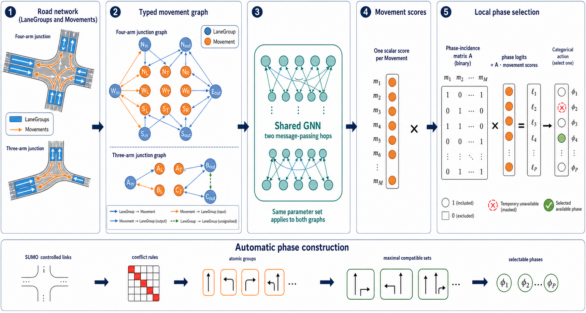
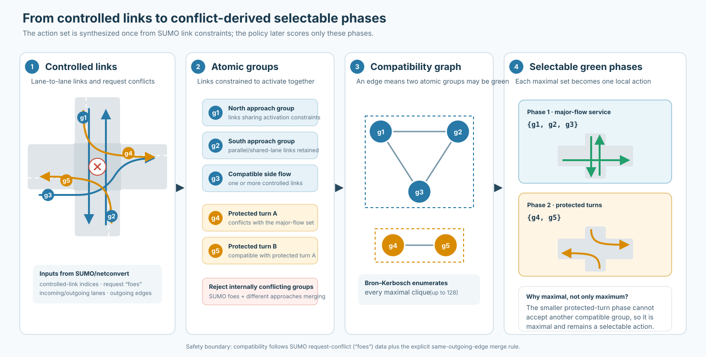

# A Graph-Based Control Interface for Traffic Signals on Heterogeneous Road Networks

> **Draft status.** Architecture-first technical-report draft. The method description reflects the final two-hop, five-second controller. Evaluation plots and the short related-work section still require a final source/artifact audit before submission.

## Abstract

Traffic-signal controllers must choose among phase sets that differ with junction geometry, lane connectivity, and signal design. A neural policy with a fixed phase-index output is therefore difficult to reuse across arbitrary road networks. This report describes a movement-centric control interface that separates road-network representation, learned prioritization, and local action construction. Directed LaneGroup nodes represent corridor traffic state, while Movement nodes represent legal controlled turns between LaneGroups. A shared typed graph neural network exchanges upstream, downstream, and neighbouring control information and produces one scalar score per Movement. At each junction, a non-learned binary incidence matrix aggregates these scores into logits for the locally available phases. The phase sets themselves are generated automatically from SUMO controlled links, activation constraints, and conflict rules by enumerating maximal compatible Movement groups. The resulting learned parameter shapes are independent of network size and local phase count. PPO experiments on synthetic grids and five OSM-derived city scenarios demonstrate that the interface can learn useful control, reuse one policy on different graph and action-space sizes, and transfer across several grid shapes. Performance on sparse signal coverage and across cities is heterogeneous, exposing limits from observation and training-distribution shift. The report presents these experiments as an evaluation of the representation and implementation rather than a claim of universal traffic-control generalization.

## 1. Introduction

The action space of a traffic signal is local. A three-arm junction, a regular four-arm intersection, and a junction with shared or dedicated turn lanes need not expose the same number or composition of phases. Phase index 2 at one signal has no inherent relationship to phase index 2 at another. A learned controller whose output weights correspond directly to fixed phase indices consequently embeds assumptions about a particular intersection schema.

This work uses traffic Movements as the interface between shared learning and local signal operation. A Movement is a legal controlled turn from an incoming directed corridor to an outgoing directed corridor. Movements have comparable semantics across networks even when their number and compatible combinations differ. The learned model therefore produces a variable-length set of Movement scores rather than a fixed vector of phase values. Each junction then converts its local scores into phase logits using a phase-incidence matrix constructed from its own signal program.

The implementation has three layers:

\[
\text{road state}
\longrightarrow
\text{Movement priorities}
\longrightarrow
\text{locally selectable phase}.
\]

First, an OSM/SUMO network is converted into a graph of directed LaneGroups and controlled Movements. Second, a shared typed graph neural network communicates traffic context and scores every Movement. Third, a deterministic control layer maps scores to conflict-derived phases and executes signal transitions.

This report makes an implementation and representation contribution:

1. a city-level graph with directed LaneGroup and Movement node types;
2. typed communication that distinguishes upstream demand, downstream supply, and pass-through context at unsignalized junctions;
3. a shared Movement-scoring GNN coupled to variable local phase spaces through fixed incidence matrices;
4. automatic construction of selectable phases from SUMO controlled-link and conflict information; and
5. an end-to-end OSM/SUMO, PPO-training, and evaluation workflow.

Movement-based traffic representation, Movement pressure, and additive Movement-to-phase scoring have prior lineage and are not claimed as independently novel. The contribution is the particular integration of the city-level typed graph, learned Movement scorer, automatic phase construction, and reusable local action interface.

**Figure 1.** Method overview. Differently structured networks produce differently sized LaneGroup/Movement graphs. The same two-hop GNN produces one score per Movement. Junction-local phase incidence and runtime availability map those scores to a selectable phase. The lower strip summarizes offline phase construction. This generated raster is a design candidate; small arrows and matrix labels must be checked at final print scale.

## 2. Related design lineage

Max-pressure control provides the clearest lineage for additive stage scoring. It assigns pressure-like priorities to traffic flows from upstream demand and downstream supply, then selects a compatible stage from the priorities it serves [1]. PressLight incorporated pressure into reinforcement-learning traffic-signal control [2]. FRAP instead organizes a learned controller around traffic Movements, phase demand, and competition between phases, with a symmetry-oriented parameterization [3].

The paper *Expression Might Be Enough* is especially close to the literal aggregation used here: it defines a phase pressure as the sum of the efficient pressures of the Movements forming that phase [4]. The present controller replaces the analytic Movement-pressure expression with scores produced by a city-level GNN, but retains a transparent additive Movement-to-phase interface.

TransferLight is the closest identified architectural comparison [5]. It constructs hierarchical segment-to-Movement-to-phase representations and learns phase energies for transfer between road networks. The implementation described here stops shared learning at scalar Movement scores. Its phase mapping is a fixed incidence sum, and its selectable phases come from a separate SUMO-based construction pipeline. The two approaches therefore share Movement-to-phase structure but apply it differently.

This section deliberately remains narrow. A final version should verify each method description from the primary publication and establish which source originally inspired the implementation. Repository history alone does not resolve whether the remembered source was *Expression Might Be Enough*, TransferLight, or another Movement-structured controller.

## 3. Network representation

### 3.1 LaneGroups

A LaneGroup is a directed road corridor between controller-relevant endpoints. Opposite travel directions are separate LaneGroups because their traffic state, capacity, queues, and destinations differ. Unambiguous corridors through unsignalized junctions may be contracted, while contraction stops before branches that would introduce false reachability.

LaneGroup features describe both current traffic and static scale. Dynamic categories include vehicle and queue counts, occupancy, speed, detector saturation, available storage, arrival and departure rates, moving vehicles approaching the queue tail, and queue-tail arrival-time estimates. Static categories include corridor length, detector length, effective lane count, and speed limit. Detector-local counts are normalized by detector capacity; they describe the observed detector region rather than pretending to measure an unobserved full-road queue.

### 3.2 Movements

A Movement is a legal signal-controlled turn from one input LaneGroup to one output LaneGroup through a particular traffic light. It is the natural point at which upstream demand and downstream supply meet. Movement features contain turn-local information such as demand, turn class, controlled-link count, and recent green state.

Junctions are not GNN nodes. They own Movements and local phase sets, and their coordinates are useful for visualization, but message passing occurs through LaneGroups, Movements, and explicit unsignalized connectors.

### 3.3 Controlled and uncontrolled transitions

At a signalized junction, traffic context passes through explicit Movement nodes. At a suitable unsignalized junction, each legal pass-through connection becomes a directed LaneGroup-to-LaneGroup message edge. Its weight is

\[
w=\exp\left(-\frac{t_{\mathrm{ff}}}{30\ \mathrm{s}}\right),
\]

where \(t_{\mathrm{ff}}\) is the connector’s free-flow travel time. This allows information to cross uncontrolled parts of the road network without creating a policy action there. Signalized junctions never receive bypass connectors.

**Figure 2.** Full graph extracted from a \(3\times3\) road layout. LaneGroups are directed corridor nodes, red points are controlled Movement nodes, and green curves are pass-through connectors at unsignalized junctions. Junction symbols provide spatial context and are not GNN nodes. A cropped local version should replace this dense full-network view in the main report.

## 4. Typed message passing

For every controlled Movement \(m\) with input LaneGroup \(l_\mathrm{in}\) and output LaneGroup \(l_\mathrm{out}\), the graph contains four directed relations:

\[
\begin{aligned}
l_\mathrm{in}&\rightarrow m, &
l_\mathrm{out}&\rightarrow m,\\
m&\rightarrow l_\mathrm{in}, &
m&\rightarrow l_\mathrm{out}.
\end{aligned}
\]

Message direction represents information flow, not vehicle travel. In particular, \(l_\mathrm{out}\rightarrow m\) carries downstream storage and spillback information back to the turn that would feed that corridor.

LaneGroup features are first encoded into a shared hidden dimension. Each Movement is initialized from its own features together with its input and output LaneGroup embeddings. One macro-hop then:

1. mean-aggregates separately transformed input- and output-LaneGroup messages into each Movement;
2. updates each Movement embedding;
3. mean-aggregates separately transformed Movement messages back into LaneGroups;
4. adds weighted LaneGroup-to-LaneGroup messages from unsignalized connectors; and
5. updates each LaneGroup embedding.

The final policy repeats this macro-hop twice. Two hops are the selected configuration used by the anchored experiments, not a demonstrated optimum. After the second hop, a shared multilayer head maps every Movement embedding to one scalar:

\[
\mathbf{s}=f_\theta(G,X),\qquad s_m\in\mathbb{R}.
\]

The actor parameters \(\theta\) are shared across all networks. The critic mean-pools the Movement embeddings owned by each traffic light and produces one value estimate per controlled junction.

## 5. From Movement scores to local actions

### 5.1 Phase incidence

Let \(M_j\) be the Movements owned by junction \(j\), and let \(P_j\) be its selectable green phases. A binary incidence matrix

\[
A_j\in\{0,1\}^{|P_j|\times |M_j|}
\]

records whether each phase enables each Movement. The phase logits are

\[
\boldsymbol{\ell}_j=A_j\mathbf{s}_j,
\qquad
\ell_{j,p}=\sum_{m\in M_j}A_{j,p,m}s_m.
\]

This sum is an intentional inductive bias: a phase accumulates the learned priorities of the compatible Movements it serves. It also makes the learned output independent of the number of phases. The report does not claim that addition is always preferable to normalized or learned phase aggregation.

### 5.2 Runtime availability

The offline phase set describes selectable compatible green states. A separate Boolean mask removes actions that are temporarily unavailable because of controller state. A masked logit is replaced by \(-\infty\), after which PPO defines one categorical distribution per junction.

Training rollouts and the primary evaluation sample from this distribution. Greedy evaluation selects the highest-logit available phase and is reported as a secondary diagnostic. When a switch is accepted, the controller immediately inserts a deterministic three-second yellow transition before the target green. Continuing the current phase introduces no transition. The anchored configuration makes decisions every five seconds and requires one decision of minimum green.

## 6. Automatic phase construction

OSM signal tags do not directly provide the local action spaces used by the policy. The build pipeline first uses SUMO `netconvert` to derive lane-to-lane connections, controlled-link indices, request indices, and the request-conflict (`foes`) relation.

Some controlled links must activate together because they share signal indices, lane constraints, or equivalent activation requirements. The builder therefore forms atomic activation groups before constructing phases. An internally conflicting atomic group is rejected.

Two atomic groups are considered incompatible when:

1. SUMO marks either request as a foe of the other; or
2. Movements from different incoming approaches merge into the same outgoing edge.

The compatible atomic groups form an undirected graph. Every maximal clique is enumerated with the Bron–Kerbosch algorithm, deduplicated, and converted into a selectable green state. *Maximal* is not the same as *maximum*: a smaller protected-turn set remains a valid action when no additional compatible group can be added to it. Enumeration fails explicitly above 128 maximal phases rather than silently truncating a complex junction.

**Figure 3.** Offline construction of conflict-derived selectable phases. The compatibility claim is bounded by SUMO request-conflict data and the added merge rule; it is not formal verification of real-world signal safety.

## 7. Training configuration

PPO is used as an optimization method rather than as a contribution. The final anchored configuration uses:

| setting | value |
|---|---:|
| policy decision interval | 5 s |
| yellow transition | immediate, 3 s |
| minimum green | 1 decision |
| message-passing macro-hops | 2 |
| rollout length | 200 decisions |
| PPO epochs per update | 4 |
| entropy coefficient | 0.001 |
| progress reward weight | 1 |
| discharge reward weight | 10 |
| braking-only penalty weight | 10 |
| local gridlock penalty weight | 0.02 |
| global/flow/throughput/direct-switch rewards | 0 |

Mixed-grid training balances the number of junction/action samples contributed by different graph shapes. This matters because a larger or more highly signalized graph otherwise supplies more local decisions per rollout and can dominate the shared PPO update. Sample-count balancing is an implementation measure for a mixed variable-size training distribution, not a new learning algorithm.

## 8. Evaluation

The evaluation asks whether the constructed interface can learn and execute across variable graph and action sizes, and where that reuse fails. Results are descriptive unless the replication level supports a stronger analysis.

### 8.1 Synthetic size and shape reuse

The synthetic study trained three independent mixed-grid policies on square and non-square grids up to \(5\times5\), with balanced local sample counts. Six fresh evaluation seeds were then used on training-like and larger/differently shaped networks up to \(6\times6\).

The learned policies improved substantially during training and generally retained useful zero-shot throughput and completion performance on the larger and differently shaped grids. This is the clearest evidence that the variable-size representation and local action interface work as intended. The \(6\times6\) target was visible in checkpoint selection, so “zero-shot” here means execution without further optimization, not an untouched final-test protocol.

The final figure should show raw training-seed means or seed points rather than treating every training-seed/evaluation-seed combination as an independent replicate. Waiting-density effects are less uniform than throughput and completion and should remain a secondary result.

### 8.2 Signal coverage

Coverage experiments changed which otherwise eligible grid junctions were signalized. A policy trained only with dense signal coverage transferred poorly to sparse control. Training around 50% coverage and a later three-hop attempt clarified the failure but did not produce uniformly convincing sparse-coverage performance.

This is a useful negative result. Changing coverage alters both the observation graph and the division of control between learned signals and unsignalized priority rules. Message passing does not remove this distribution shift. The result should appear as a compact limitation panel or appendix study, not as a principal success claim.

### 8.3 Heterogeneous city scenarios

The city workflow was exercised on OSM-derived scenarios for Karlsruhe, Mannheim, Heidelberg, Freiburg, and Stuttgart. Their extracted graphs differ substantially in controller count, LaneGroup count, Movement count, and local phase cardinality. The final run trained from Karlsruhe, Mannheim, Heidelberg, and Freiburg rollouts. Stuttgart produced zero rollout jobs and was excluded from train-only checkpoint selection, but it was evaluated during development and is therefore visible validation rather than an untouched test city.

At iteration 60, the selected sampled policy averaged 3345.6 vehicles/hour, 64.93% completion, and 0.613 s/m wait density over the five scenarios. The strongest aggregate baseline values were 3036.8 vehicles/hour and 59.37% completion for max pressure, while fixed time had the lowest listed aggregate wait density at 0.526 s/m. These macro averages conceal important city differences:

- Karlsruhe is a clear learned-policy win.
- Mannheim regressed by iteration 60, and queue control can be better.
- Stuttgart is a convincing visible-validation throughput/completion result: sampled control achieved 4216 vehicles/hour and 50.93% completion, compared with 3661 and 43.97% for fixed time and 3459 and 41.78% for max pressure.
- Heidelberg is competitive, with fixed time slightly better.
- Freiburg is positive under sampled control, while greedy control is closer to fixed time.

Sampled execution is the principal learned result because it matches the stochastic policy optimized by PPO. Greedy execution is less stable and often has higher wait density. The city study has one training seed and supports a feasibility case study, not a multi-seed or universal city-generalization claim.

## 9. Discussion and limitations

The central result is architectural. The controller can ingest different network graphs, produce different numbers of Movement scores, and act through different local phase spaces without changing its learned parameter dimensions. The synthetic experiments show that this property can translate into useful size/shape reuse, while the city experiments show that the complete pipeline operates on heterogeneous OSM-derived networks.

Several boundaries remain:

- Additive phase logits assume that Movement utilities combine linearly and structurally favour phases serving more positively scored Movements.
- The phase constructor is only as reliable as the imported SUMO link and conflict data plus the implemented merge rule.
- Detector-local features cannot observe queues beyond their sensing region.
- Sparse signal coverage changes the graph and control distribution and is not handled uniformly.
- City demand, geometry, and baseline behaviour differ; one city training seed cannot establish broad transfer reliability.
- Sampled and greedy execution are not interchangeable. The deterministic argmax policy may expose brittle score calibration hidden by stochastic sampling.
- Baseline controller timings must be disclosed where they differ from the learned controller’s five-second decisions.

These limitations do not invalidate the representation objective. They specify what the current implementation supports by construction and what still depends on training distribution and empirical calibration.

## 10. Conclusion

This report presented a reusable graph-based traffic-signal control interface built around directed corridor state, controlled Movements, and local conflict-derived phase sets. A shared typed GNN communicates traffic context and scores Movements, while deterministic incidence matrices and runtime masks translate those scores into variable-size junction actions. Automatic phase construction connects the learned interface to heterogeneous SUMO networks without a universal phase template.

Synthetic grids provide the clearest evidence that the representation can support learning and zero-shot execution across different network sizes and shapes. Sparse-coverage and city evaluations show that architectural size independence is not the same as guaranteed distributional generalization. The resulting system is best understood as a transparent, scalable implementation whose shared learned vocabulary is the Movement, while valid phase combinations remain local to each junction.

## References requiring final verification

1. Varaiya, P. (2013). *Max pressure control of a network of signalized intersections*. Transportation Research Part C, 36, 177–195. https://doi.org/10.1016/j.trc.2013.08.014
2. Wei, H., et al. (2019). *PressLight: Learning max pressure control to coordinate traffic signals in arterial network*. KDD. https://doi.org/10.1145/3292500.3330949
3. Zheng, G., et al. (2019). *Learning phase competition for traffic signal control*. https://arxiv.org/abs/1905.04722
4. Zhang, L., et al. (2022). *Expression Might Be Enough: Representing Pressure and Demand for Reinforcement Learning Based Traffic Signal Control*. ICML. **[Verify author list and proceedings record.]**
5. Schmidt, et al. *TransferLight: Zero-Shot Traffic Signal Control on any Road-Network*. **[Verify final author list, venue, year, and canonical URL.]**
6. Schulman, J., et al. (2017). *Proximal Policy Optimization Algorithms*. https://arxiv.org/abs/1707.06347
7. Bron, C., and Kerbosch, J. (1973). *Algorithm 457: Finding all cliques of an undirected graph*. Communications of the ACM, 16(9), 575–577.
