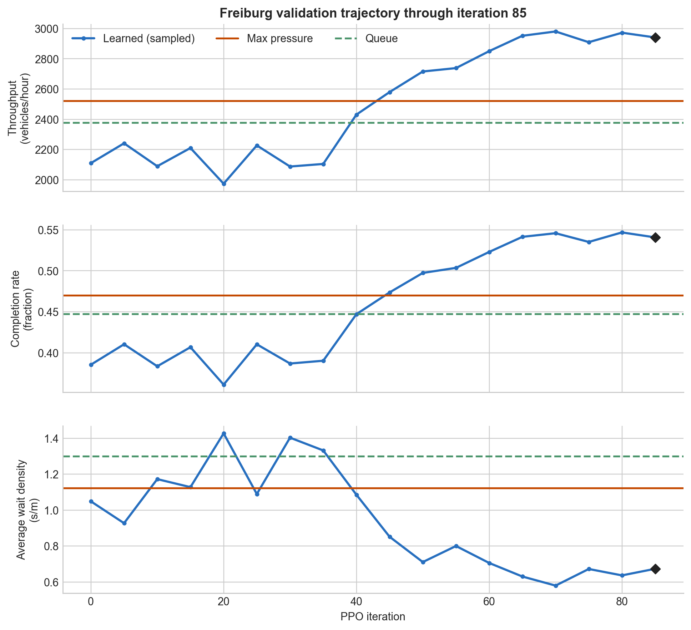
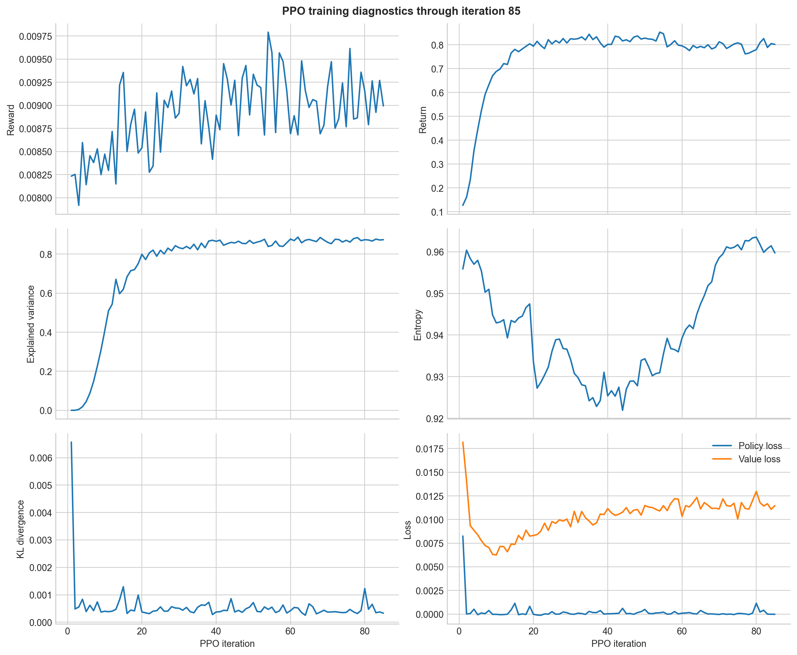
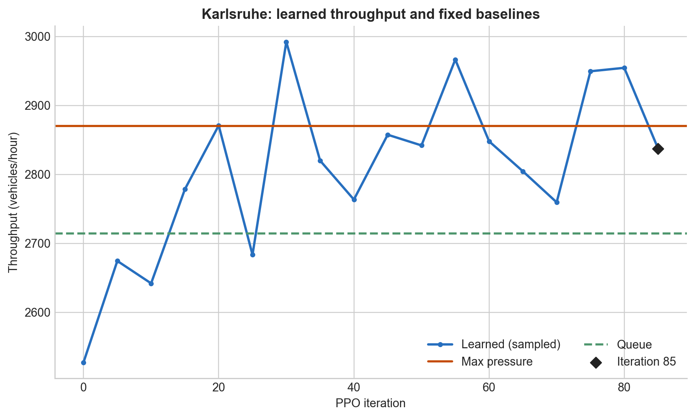
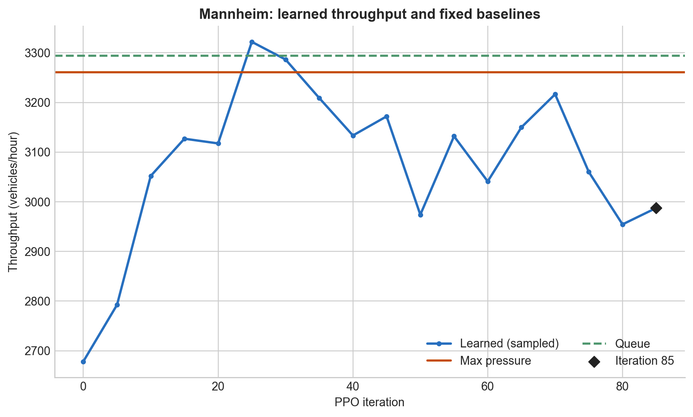
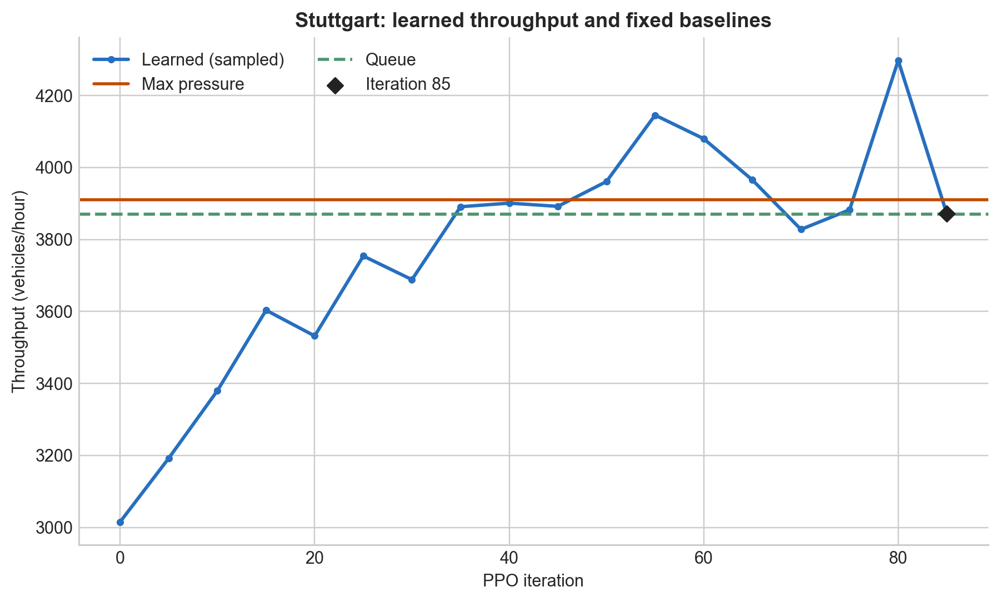
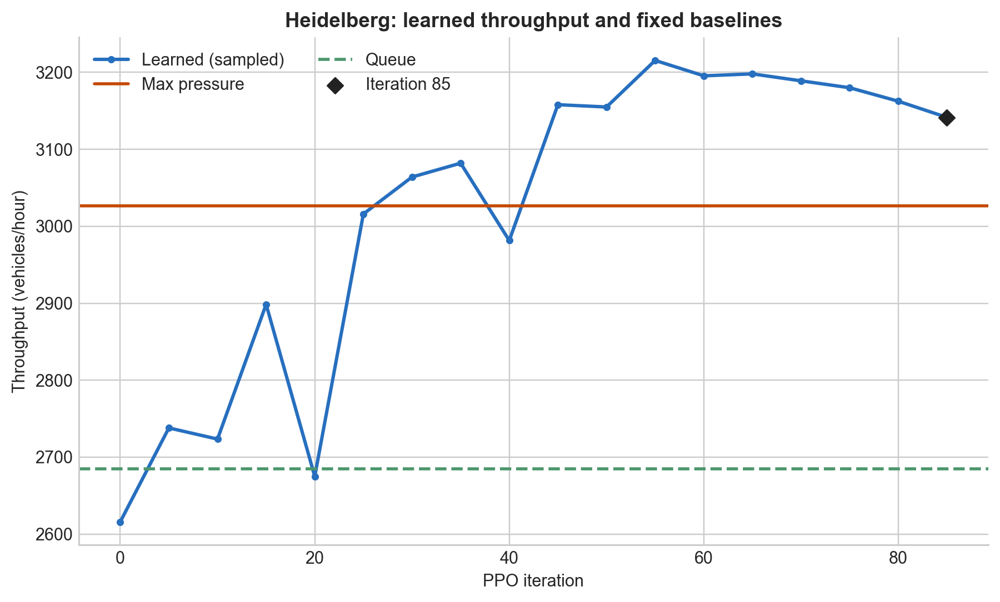
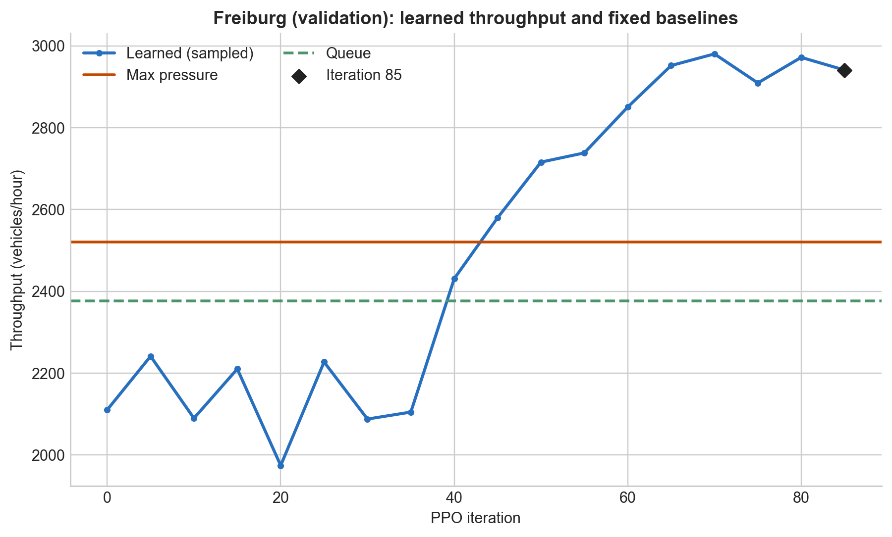

# City First-Pass Throughput PPO: Scratch, 32 Workers

This report describes the completed 85-iteration multi-city scratch-training run and its final checkpoint.

## Result

A scratch-trained generalist GNN PPO controller reached or exceeded strong baselines on several OSM-derived cities and substantially outperformed them on the validation city at iteration 85. It did not beat every baseline in every city.

Freiburg generated no PPO rollouts. It was used as a topology-held-out validation city during development and is not an untouched final test set. A final generalization study should use multiple independent training seeds, fresh evaluation seeds, and another unseen city.

## Experiment setup

The policy and critic were initialized from random weights. PPO rollouts came from Karlsruhe, Mannheim, Stuttgart, and Heidelberg.

| setting | value |
| --- | --- |
| training length | 85 PPO iterations |
| SUMO backend | libsumo |
| rollout workers | 32 |
| rollout jobs per update | 40: 10 per training city |
| decision steps per rollout | 350 |
| decision interval | 10 seconds |
| PPO update epochs | 2 |
| value warm-up | none |
| learned evaluation | sampled legal actions, temperature 1.0 |
| evaluation seeds | 100, 101, 102, 103, 104, 105 |
| evaluation horizon | 1,200 simulated seconds; 120 decision opportunities |
| evaluation demand scale | 1.0 |
| evaluation frequency | every 5 iterations |

Reward weights were local throughput `1.0`, global reward `0.2`, vehicle progress `0.25`, gridlock penalty `0.08`, and speed change `0.005`. Initial occupancy was sampled from 5–8%. Training demand was sampled from `0.8..1.2`, with Mannheim and Stuttgart capped at `1.05`.

The exact configuration is [`configs/training/city_first_pass_throughput_scratch_32_worker.yaml`](../../configs/training/city_first_pass_throughput_scratch_32_worker.yaml). Run metadata records a one-hop, 64-hidden-unit GNN with 29 lane features and four movement features.

## Policy and baselines

The learned GNN produces movement scores, sums them into per-junction phase logits, masks currently illegal phases, and samples one legal categorical action per junction. PPO rollout collection and learned evaluation use the same action-mask and sampling semantics.

Max pressure and queue are deterministic for a fixed city, demand, and seed. They score the same legal phases using hand-designed pressure or queue criteria and select the maximum. Their values are fixed references across the training plots.

## Iteration-85 evaluation

The following values are means over six fixed-seed episodes. Throughput is completed vehicles per hour. Wait density is interval-average accumulated waiting seconds per incoming lane metre. Average waiting time covers completed trips only and must be interpreted together with completion.

| city | split | policy | throughput / h | completion | wait density (s/m) | avg. waiting (s) |
| --- | --- | --- | ---: | ---: | ---: | ---: |
| Karlsruhe | train | learned | **2,837.5** | 80.6% | 0.435 | 163.9 |
|  |  | max pressure | 2,870.0 | 81.8% | 0.388 | 119.5 |
|  |  | queue | 2,714.5 | 77.7% | 0.535 | 125.5 |
| Mannheim | train | learned | **2,987.5** | 51.9% | 0.656 | 195.9 |
|  |  | max pressure | 3,260.5 | 55.9% | 1.053 | 117.8 |
|  |  | queue | 3,294.0 | 56.5% | 1.012 | 122.6 |
| Stuttgart | train | learned | **3,871.5** | 48.0% | 1.178 | 181.2 |
|  |  | max pressure | 3,911.0 | 48.9% | 1.206 | 144.5 |
|  |  | queue | 3,870.5 | 48.0% | 1.183 | 136.9 |
| Heidelberg | train | learned | **3,141.5** | 78.3% | 0.166 | 163.9 |
|  |  | max pressure | 3,026.5 | 75.7% | 0.435 | 90.5 |
|  |  | queue | 2,684.5 | 67.8% | 0.872 | 77.8 |
| Freiburg | validation | learned | **2,941.0** | **54.1%** | **0.673** | 214.9 |
|  |  | max pressure | 2,521.0 | 47.0% | 1.122 | 157.5 |
|  |  | queue | 2,377.0 | 44.7% | 1.300 | 149.6 |

At the final checkpoint, learned control beat both baselines on Heidelberg and Freiburg throughput, was effectively tied with queue and close to max pressure on Stuttgart, was close to max pressure and above queue on Karlsruhe, and trailed both baselines on Mannheim.

Lower completed-trip waiting time for a baseline does not necessarily indicate a better network state when completion is also lower. This report includes completion and wait density to expose that censoring effect.

## Training trajectory

Learned throughput improved substantially over the 85 training iterations, most visibly on Stuttgart and Freiburg.


Freiburg improved from roughly 2,100 vehicles/hour at initialization to 2,941 vehicles/hour, while completion increased from 38.6% to 54.1% and wait density decreased from 1.049 to 0.673.



The critic explained variance rose from approximately zero to above `0.85`. Entropy remained high, consistent with a stochastic categorical controller rather than a collapsed single-action policy.



## Per-city throughput trajectories











## Limitations

- This is one training run and one final checkpoint.
- The same six scenario seeds were used for periodic development evaluation.
- Freiburg was held out from rollout generation but was visible during development.
- Learned evaluation contains action sampling variability in addition to scenario variability.
- Some cities have low absolute completion at the 1,200-step horizon.
- Mannheim remained materially behind both deterministic baselines.

Before making a strong generalization claim, repeat training with independent seeds and evaluate a frozen protocol on fresh scenario seeds and another unseen OSM city.

## Evidence and reproduction

- evidence bundle and integrity manifest: [`artifacts/.../README.md`](../../artifacts/ppo_runs/city_first_pass_throughput_progress_025_sample_eval_v3/README.md)
- final policy: [`movement_policy_iter_0085_best.pt`](../../artifacts/ppo_runs/city_first_pass_throughput_progress_025_sample_eval_v3/selected_iteration_0085/movement_policy_iter_0085_best.pt)
- final PPO state: [`movement_ppo_iter_0085_best.pt`](../../artifacts/ppo_runs/city_first_pass_throughput_progress_025_sample_eval_v3/selected_iteration_0085/movement_ppo_iter_0085_best.pt)
- evaluation: [`summary.csv`](../../artifacts/ppo_runs/city_first_pass_throughput_progress_025_sample_eval_v3/selected_iteration_0085/evaluation/summary.csv) and [`summary.json`](../../artifacts/ppo_runs/city_first_pass_throughput_progress_025_sample_eval_v3/selected_iteration_0085/evaluation/summary.json)
- TensorBoard through iteration 85: [`tensorboard_through_iter_0085/`](../../artifacts/ppo_runs/city_first_pass_throughput_progress_025_sample_eval_v3/tensorboard_through_iter_0085/)
- training console through iteration 85: [`train_stdout.log`](../../artifacts/ppo_runs/city_first_pass_throughput_progress_025_sample_eval_v3/runs/train_stdout.log)
- run metadata: [`run_metadata.json`](../../artifacts/ppo_runs/city_first_pass_throughput_progress_025_sample_eval_v3/runs/run_metadata.json)

Regenerate every result plot:

```powershell
uv run --group dev python scripts\plot_city_first_pass_results.py
```

Evaluation and GUI commands are documented in the project [README](../../README.md) and [training guide](../training_and_evaluation.md).
