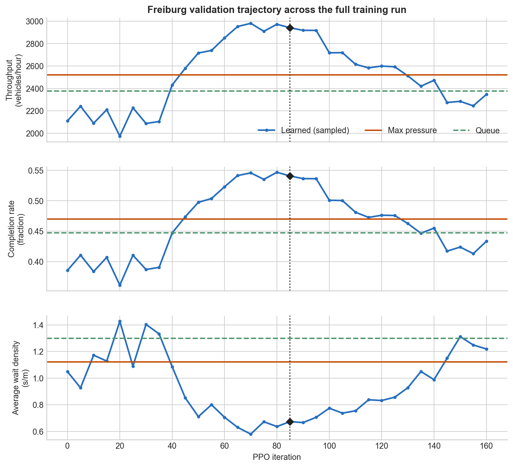
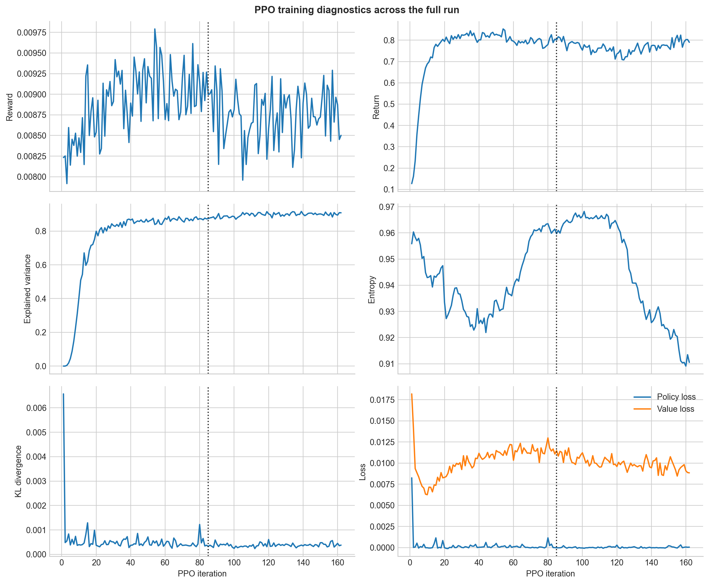
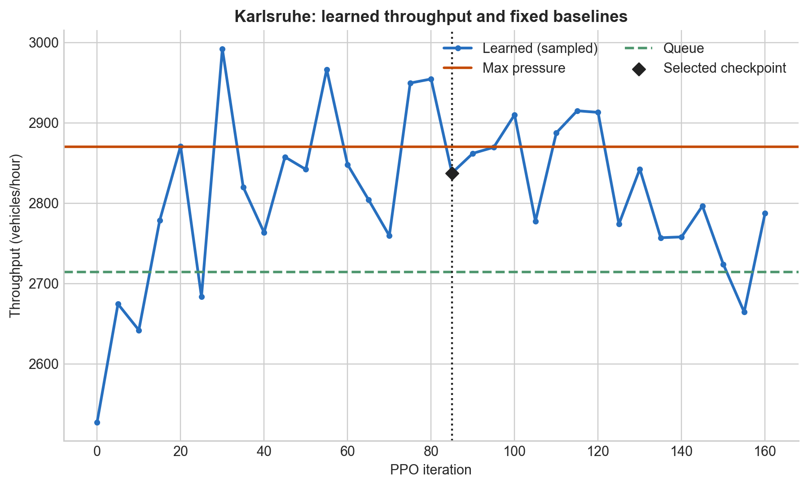
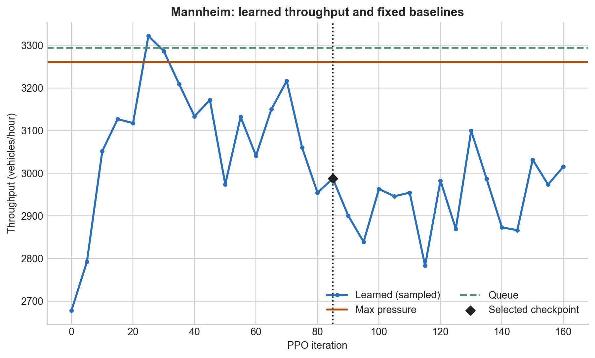
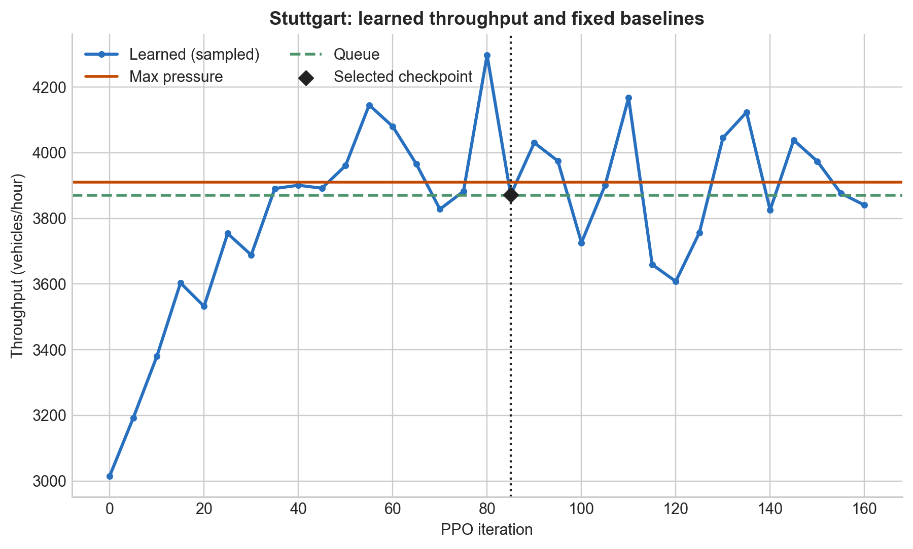
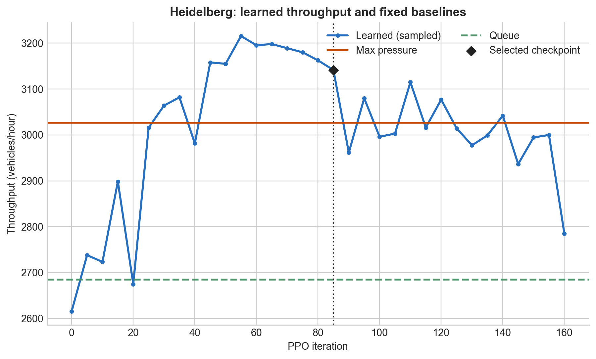
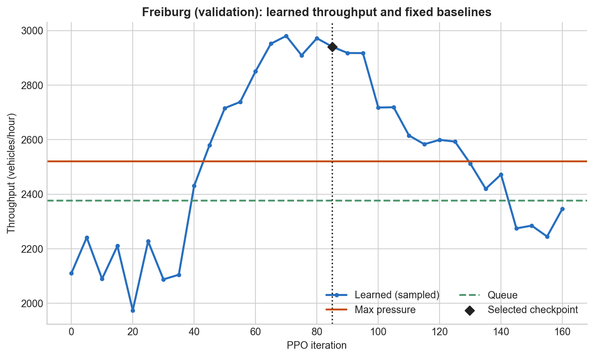

# City First-Pass Throughput PPO: Scratch, 32 Workers

This report is the source of truth for the strongest completed multi-city scratch-training run. It describes the selected iteration-85 checkpoint and preserves the later regression as part of the scientific record.

## Claim and scope

A scratch-trained generalist GNN PPO controller reached or exceeded strong baselines on several OSM-derived cities and substantially outperformed them on the validation city at the selected checkpoint. This is evidence of promising cross-city transfer, not a final generalization result.

Freiburg was excluded from PPO rollout generation, but it was evaluated every five iterations and contributed to best-checkpoint selection. It is therefore **held out from training / validation**, not an untouched final test city. A final evaluation should use multiple independent training seeds, fresh evaluation seeds, and at least one additional unseen city.

## Experiment setup

The policy was initialized from random weights rather than imitation learning. PPO rollouts came from Karlsruhe, Mannheim, Stuttgart, and Heidelberg. Freiburg generated no PPO rollout jobs.

| setting | value |
| --- | --- |
| SUMO backend | libsumo |
| rollout workers | 32 |
| rollout jobs per update | 40 (10 per training city) |
| decision steps per rollout | 350 |
| decision interval | 10 seconds |
| PPO update epochs | 2 |
| value warm-up | none |
| learned evaluation | sampled legal actions, temperature 1.0 |
| evaluation seeds | 100, 101, 102, 103, 104, 105 |
| evaluation horizon | 1,200 decision steps |
| evaluation demand scale | 1.0 |
| evaluation frequency | every 5 PPO iterations |

The reward combined throughput (`1.0`), a global component (`0.2`), vehicle progress (`0.25`), a gridlock penalty (`0.08`), and speed-change regularization (`0.005`). Training demand was sampled from `0.8..1.2`, with Mannheim and Stuttgart capped at `1.05`. Initial network occupancy was sampled from 5–8%.

The exact configuration is [`configs/training/city_first_pass_throughput_scratch_32_worker.yaml`](../../configs/training/city_first_pass_throughput_scratch_32_worker.yaml). Run metadata confirms a one-hop, 64-hidden-unit model with 29 lane features and four movement features.

## Policy and baseline semantics

The learned controller produces movement scores, sums them into phase logits, masks currently illegal phases, and samples a categorical action independently for each junction. Both PPO rollout collection and this learned-policy evaluation use the same legal-action mask and stochastic phase-sampling semantics. Sampling is intentional: it evaluates the policy distribution optimized by PPO rather than silently changing the controller to greedy argmax behavior.

Max pressure and queue are deterministic controllers for a fixed city, demand, and seed. They score legal phases using hand-designed pressure or queue criteria and choose the best available phase. Their values are fixed reference lines in the training plots; only the learned policy changes across checkpoints.

## Selected checkpoint: iteration 85

The table reports the mean of six fixed-seed episodes. Wait density is interval-average accumulated waiting seconds per incoming lane metre. Average waiting time covers completed trips and must be read together with completion rate, because unfinished difficult trips are excluded from that trip-level average.

| city | split | policy | throughput / h | completion | wait density (s/m) | avg. waiting (s) |
| --- | --- | --- | ---: | ---: | ---: | ---: |
| Karlsruhe | train | learned | **2,837.5** | 80.6% | 0.435 | 163.9 |
|  |  | max pressure | 2,870.0 | 81.8% | 0.388 | 119.5 |
|  |  | queue | 2,714.5 | 77.7% | 0.535 | 125.5 |
| Mannheim | train | learned | **2,987.5** | 51.9% | 0.656 | 195.9 |
|  |  | max pressure | 3,260.5 | 55.9% | 1.053 | 117.8 |
|  |  | queue | 3,294.0 | 56.5% | 1.012 | 122.6 |
| Stuttgart | train | learned | **3,871.5** | 48.0% | 1.178 | 181.2 |
|  |  | max pressure | 3,911.0 | 48.9% | 1.206 | 144.5 |
|  |  | queue | 3,870.5 | 48.0% | 1.183 | 136.9 |
| Heidelberg | train | learned | **3,141.5** | 78.3% | 0.166 | 163.9 |
|  |  | max pressure | 3,026.5 | 75.7% | 0.435 | 90.5 |
|  |  | queue | 2,684.5 | 67.8% | 0.872 | 77.8 |
| Freiburg | validation | learned | **2,941.0** | **54.1%** | **0.673** | 214.9 |
|  |  | max pressure | 2,521.0 | 47.0% | 1.122 | 157.5 |
|  |  | queue | 2,377.0 | 44.7% | 1.300 | 149.6 |

At one deployable checkpoint, learned control beat max pressure and queue on Heidelberg and Freiburg throughput, was effectively tied with queue and close to max pressure on Stuttgart, was close to max pressure and above queue on Karlsruhe, and trailed both baselines on Mannheim. Lower trip-level waiting time for a baseline does not override its lower completion: both quantities are reported precisely to expose that censoring effect.

## Training trajectory and checkpoint selection

Validation performance improved strongly through roughly iterations 70–85. Freiburg rose from about 2,100 vehicles/hour at initialization to 2,941 vehicles/hour at iteration 85, while completion increased and wait density fell. Performance then regressed persistently. By the end of the downloaded trajectory at iteration 160, Freiburg was below max-pressure throughput and completion again, with substantially higher wait density.

Iteration 85 was retained as the best checkpoint. The selection used periodic evaluation, including Freiburg, so the result is a selected validation checkpoint rather than an unbiased final estimate. Individual cities also reached exploratory historical peaks at different iterations; those peaks must not be combined into a claim about one deployable policy.




The later decline is not filtered out. The full 0–162 PPO diagnostics and 0–160 periodic evaluations are shown here and remain available in the raw event data and stdout log.



## Per-city comparisons

Each plot shows the complete downloaded learned-policy trajectory, the fixed deterministic baselines, and the iteration-85 selection marker.











## Limitations and next evaluation

- This is one training run and one selected checkpoint; optimization stability is unresolved.
- The six evaluation seeds were reused for periodic model selection.
- Freiburg is topology-held-out from rollouts, but not untouched by the research process.
- Sampled action evaluation contains policy stochasticity in addition to scenario variability; six seeds provide only a modest estimate.
- Some cities have low absolute completion at the 1,200-step horizon, so throughput, completion, congestion, and trip metrics must be interpreted jointly.
- The late regression indicates that the current reward, optimizer, or checkpoint-selection procedure does not guarantee stable improvement.

Before making a strong generalization claim, train multiple independent seeds and evaluate frozen selection rules on fresh scenario seeds and another unseen OSM-derived city. Report uncertainty intervals and retain full trajectories for every run.

## Evidence and reproduction

Primary artifacts:

- selected policy: [`movement_policy_iter_0085_best.pt`](../../artifacts/ppo_runs/city_first_pass_throughput_progress_025_sample_eval_v3/selected_iteration_0085/movement_policy_iter_0085_best.pt)
- selected PPO state: [`movement_ppo_iter_0085_best.pt`](../../artifacts/ppo_runs/city_first_pass_throughput_progress_025_sample_eval_v3/selected_iteration_0085/movement_ppo_iter_0085_best.pt)
- selected evaluation: [`summary.csv`](../../artifacts/ppo_runs/city_first_pass_throughput_progress_025_sample_eval_v3/selected_iteration_0085/evaluation/summary.csv) and [`summary.json`](../../artifacts/ppo_runs/city_first_pass_throughput_progress_025_sample_eval_v3/selected_iteration_0085/evaluation/summary.json)
- full TensorBoard: [`tensorboard_full/`](../../artifacts/ppo_runs/city_first_pass_throughput_progress_025_sample_eval_v3/tensorboard_full/)
- curated TensorBoard through iteration 85: [`tensorboard_through_iter_0085/`](../../artifacts/ppo_runs/city_first_pass_throughput_progress_025_sample_eval_v3/tensorboard_through_iter_0085/)
- full stdout: [`train_stdout.log`](../../artifacts/ppo_runs/city_first_pass_throughput_progress_025_sample_eval_v3/runs/train_stdout.log)

Regenerate every static figure from the full event stream:

```powershell
uv run --group dev python scripts\plot_city_first_pass_results.py
```

The selected-checkpoint evaluation command is in the project [README](../../README.md).
