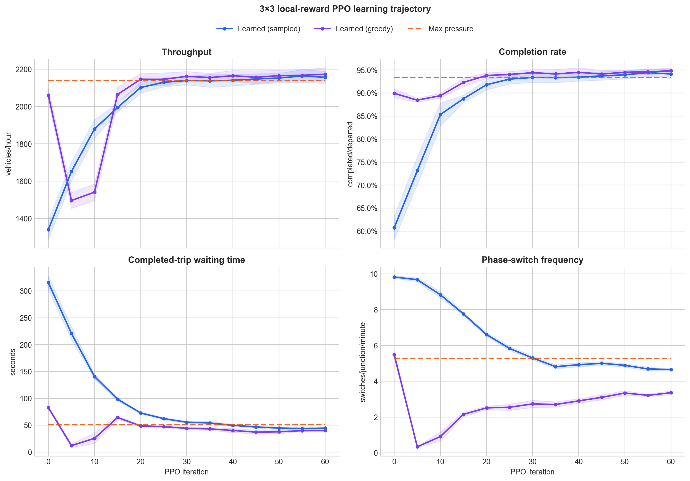
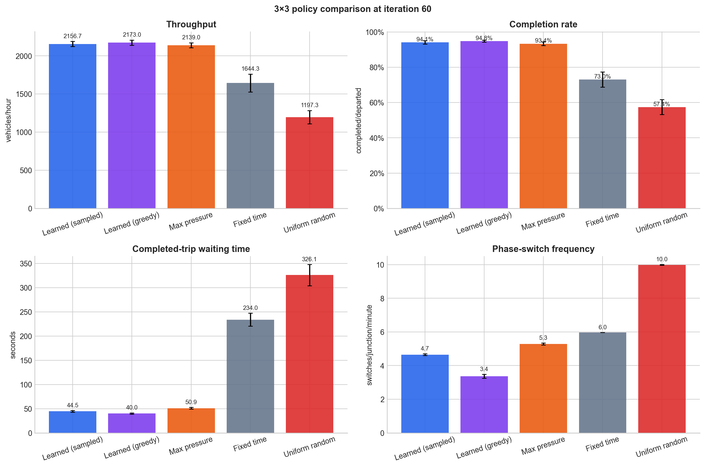

# 3×3 Local-Reward PPO Validation

This report documents the completed 60-iteration validation run on the generated 3×3 grid and the
resulting hypothesis for why the same PPO system is harder to train on the OSM-derived city scenarios.

## Result

The two-hop PPO controller learned a strong policy on the 3×3 grid. At iteration 60, both sampled and
greedy evaluation exceeded max pressure on throughput, completion, completed-trip waiting time, and
phase-switch frequency over the six fixed evaluation seeds.

This establishes that the policy, action sampling, reward plumbing, advantage calculation, and PPO
updates can produce useful traffic control under a dense, regular control topology. It does **not**
establish that city size or complexity is the sole cause of the weaker city result.

The more precise working hypothesis is that city training has a harder control and credit-assignment
problem:

- signalized junctions are sparse relative to the road network, even though cities contain more signals
  in absolute terms;
- vehicles traverse longer and more heterogeneous unsignalized paths between policy actions;
- signal influence, vehicle observations, and local reward attribution are separated by more simulator
  dynamics;
- topology, route structure, demand, phase count, and signal coverage vary simultaneously.

These factors should be separated in controlled grid experiments before changing the reward or PPO
hyperparameters again.

## Experiment setup

The policy and critic started from random weights. Training used only the generated
`grid_3x3_dedicated` scenario.

| setting | value |
| --- | --- |
| completed training length | 60 PPO iterations |
| GNN depth | 2 hops |
| rollout workers | 32 |
| rollouts per update | 100 |
| decisions per rollout | 200 |
| simulated time per rollout | 1,000 seconds |
| PPO epochs per update | 4 |
| decision interval | 5 seconds |
| yellow transition | starts immediately; lasts 3 seconds |
| minimum green | 1 decision |
| initial occupancy | uniformly sampled from 6–8% |
| native warm-up | 15 seconds |
| training demand scale | uniformly sampled from 0.6–0.8 |
| evaluation demand scale | 0.7 |
| evaluation | every 5 iterations; six seeds; 1,800 seconds |
| learned evaluation | sampled and greedy |

The local reward used progress weight `1.0`, discharge weight `10.0`, braking-only speed-change weight
`10.0`, and local gridlock weight `0.02`. Global arrival, flow, throughput, and direct switch terms were
disabled.

At iteration 60, the logged raw rollout means were progress `0.0027`, discharge `0.0002`, and braking
change `0.0001`. Their approximate weighted magnitudes were therefore `0.0027`, `0.0020`, and `0.0010`.
This is evidence that the selected weights placed the active terms on comparable scales in this
scenario.

The exact configuration is
[`configs/training/grid_3x3_local_reward_2hop_30.yaml`](../../configs/training/grid_3x3_local_reward_2hop_30.yaml).
The run was extended from iteration 30 to iteration 60 without changing its scientific settings.

## Learning trajectory



| iteration/policy | throughput / h | completion | avg. waiting | switches/junction/min |
| --- | ---: | ---: | ---: | ---: |
| 0 sampled | 1,340.7 | 60.7% | 315.5 s | 9.82 |
| 30 sampled | 2,139.3 | 93.4% | 55.5 s | 5.30 |
| 55 sampled | **2,163.7** | **94.4%** | **43.7 s** | 4.69 |
| 60 sampled | 2,156.7 | 94.1% | 44.5 s | **4.65** |
| 60 greedy | **2,173.0** | **94.8%** | **40.0 s** | **3.36** |
| max pressure | 2,139.0 | 93.4% | 50.9 s | 5.28 |

Sampled control made most of its throughput and completion gains by iteration 30, then continued to
reduce completed-trip waiting time and switching. The best sampled throughput and waiting-time point
was iteration 55. Greedy throughput continued to improve slightly through iteration 60.

The iteration-0 greedy curve is initially much stronger than sampled control because the untrained
network's small logit differences define a deterministic phase preference, whereas categorical
sampling switches nearly uniformly. PPO first changes that arbitrary deterministic preference before
converging to a useful greedy rule.

## Iteration-60 comparison



Queue and max pressure produced identical results on this single-lane regular grid, so the plot shows
max pressure once.

Using the same six scenario seeds as paired observations, iteration-60 differences relative to max
pressure were:

| policy | throughput / h | completion | avg. waiting | switches/junction/min |
| --- | ---: | ---: | ---: | ---: |
| sampled | +17.7 ± 10.3 | +0.77 ± 0.44 pp | −6.37 ± 3.14 s | −0.63 ± 0.09 |
| greedy | +34.0 ± 14.7 | +1.48 ± 0.63 pp | −10.89 ± 2.52 s | −1.92 ± 0.16 |

The intervals are paired 95% normal intervals over six fixed seeds. They describe this development
evaluation set only; repeated checkpoint selection on these seeds prevents treating them as an
untouched test set.

Wait density remained higher than max pressure (`0.067` sampled and `0.099` greedy versus `0.034`
s/m). Throughput, completion, and completed-trip waiting time were the primary metrics for this study.
The result suggests that the learned controller permits some temporary queue accumulation while
serving vehicles more efficiently overall.

## Structural contrast with city scenarios

The generated grids are not merely smaller. They are much more densely controlled:

| scenario | internal/grid junctions | signalized junctions | signal coverage |
| --- | ---: | ---: | ---: |
| 3×3 dedicated | 9 | 5 | 55.6% |
| 4×4 dedicated | 16 | 12 | 75.0% |
| 6×6 dedicated | 36 | 32 | 88.9% |
| Karlsruhe | 141 | 42 | 29.8% |
| Mannheim | 417 | 100 | 24.0% |
| Stuttgart | 290 | 71 | 24.5% |
| Heidelberg | 244 | 55 | 22.5% |
| Freiburg | 231 | 63 | 27.3% |

The grid generator signals nodes with degree at least three, leaving the four grid corners
unsignalized. Consequently, signal coverage increases with grid size. Grid size and signal coverage
are therefore confounded unless the next study explicitly controls for both.

The city graph also contains hundreds of unsignalized connectors and heterogeneous phase programs.
With a two-hop GNN, each decision is intentionally local. Coordination beyond that receptive field
must emerge through repeated closed-loop decisions, and distant traffic is not observed until it
approaches the controlled subgraph.

## Recommended next study

The next experiment should be a controlled synthetic curriculum and zero-shot size-generalization
matrix.

1. Regenerate a matched 3×3, 4×4, 5×5, 6×6, and 7×7 suite using the current generator. Visually and
   quantitatively verify route generation, initial occupancy, warm-up, demand, teleports, and
   saturation before training.
2. Freeze the successful two-hop control timing, local reward, PPO settings, occupancy, warm-up, and
   demand range from this run.
3. Train on a balanced mixture of 3×3, 4×4, and 5×5 grids. Audit whether PPO samples are balanced by
   rollout, decision, junction, or legal action; larger grids must not dominate merely because they
   contain more controllers.
4. Use 6×6 as a visible validation size and 7×7 as a final held-out size. Add 9×9 only after the first
   extrapolation step succeeds.
5. Report a full train-size by evaluation-size matrix at demand scales `0.6`, `0.7`, and `0.8`, using
   fresh seeds for the final test.
6. Run a separate signal-coverage ablation by removing a controlled fraction of signals or inserting
   unsignalized gaps while keeping grid size and demand fixed.
7. Gate the study with a short 30/60-iteration run. If within-size learning and 6×6 zero-shot
   performance are credible, repeat the final design with at least three independent training seeds.

The decisive comparison is not simply “grid versus city.” It is whether performance degrades as
unsignalized distance and control sparsity increase while all other factors remain fixed.

## Limitations

- This is one training seed on one topology.
- Evaluation seeds were reused every five iterations.
- The reward weights were calibrated on this 3×3 demand regime.
- The 3×3, 4×4, and 6×6 files were generated at different points in project development; a matched
  regeneration is required before comparing sizes.
- Strong zero-shot grid-size transfer would not by itself prove transfer to irregular OSM cities.

## Evidence and reproduction

- evidence bundle:
  [`artifacts/ppo_runs/grid_3x3_local_reward_2hop_iter_0060_repeat_01/`](../../artifacts/ppo_runs/grid_3x3_local_reward_2hop_iter_0060_repeat_01/)
- iteration-60 evaluation:
  [`summary.csv`](../../artifacts/ppo_runs/grid_3x3_local_reward_2hop_iter_0060_repeat_01/checkpoints/rl/grid_3x3_local_reward_2hop_5s_warmup15_demand_06_08_rollouts100x200_30_repeat_01/eval/iter_0060/summary.csv)
- training console:
  [`train_stdout.log`](../../artifacts/ppo_runs/grid_3x3_local_reward_2hop_iter_0060_repeat_01/runs/rl/grid_3x3_local_reward_2hop_5s_warmup15_demand_06_08_rollouts100x200_30_repeat_01/train_stdout.log)
- run metadata:
  [`run_metadata.json`](../../artifacts/ppo_runs/grid_3x3_local_reward_2hop_iter_0060_repeat_01/runs/rl/grid_3x3_local_reward_2hop_5s_warmup15_demand_06_08_rollouts100x200_30_repeat_01/run_metadata.json)

Regenerate both figures:

```powershell
uv run --group dev python scripts\plot_grid3_local_reward_results.py
```
