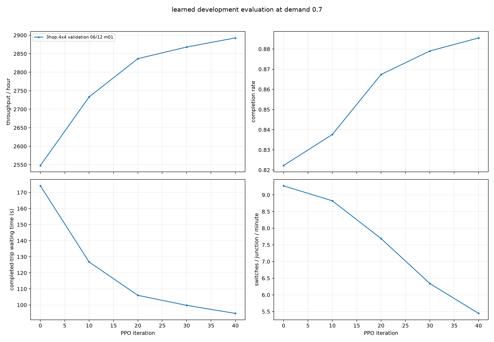
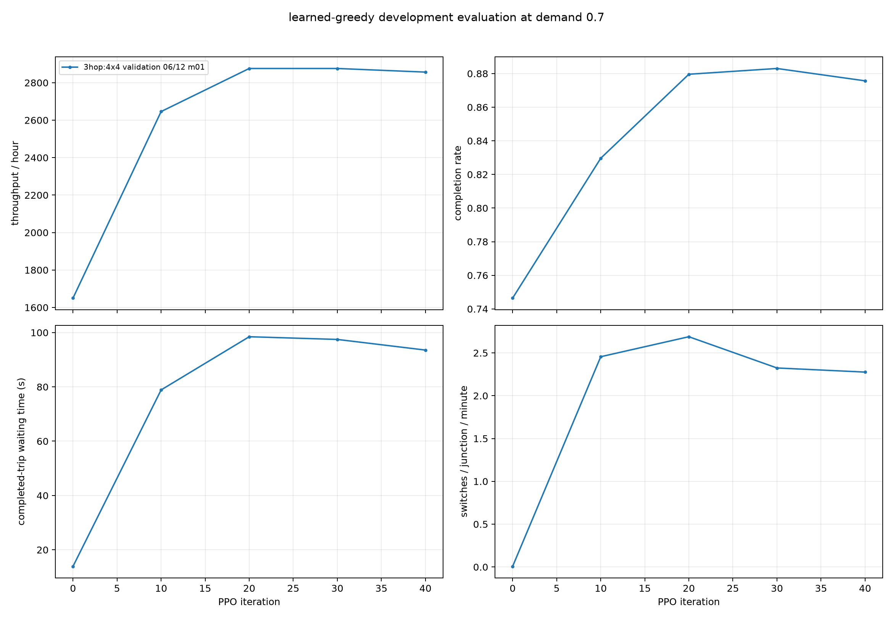
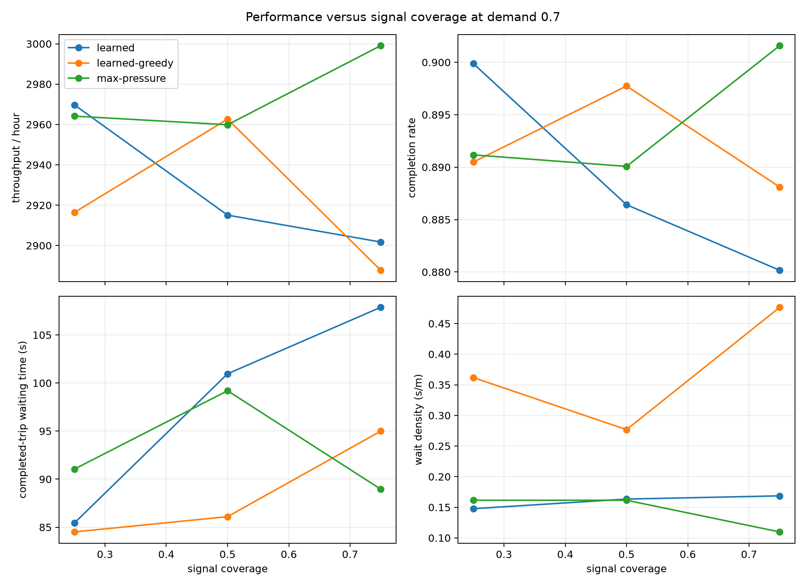

# Three-Hop 4x4 Signal-Coverage Study

## Result

Increasing the policy receptive field from two to three graph hops did not improve throughput or
completion generalization. The three-hop policy learned faster early in training and produced some
better waiting-time behavior, but its final sampled throughput was statistically indistinguishable
from the two-hop policy at 25%, 50%, and 75% coverage. Its final greedy policy was materially worse
than two hops at 75% coverage.

Three hops therefore does not solve the signal-coverage result. The two-hop model remains the better
default: it is smaller, reaches comparable sampled performance in 30 rather than 40 iterations, and
has the stronger greedy 75%-coverage result.

## Training seed versus rollout seeds

The earlier statement that the coverage study had "one training seed" meant one independent PPO
replica: one random initialization and one optimization trajectory, identified by training seed
`6101`. It did not mean that all rollouts reused one simulator seed.

Both the two-hop and three-hop runs generated rollout seeds as:

`training seed + iteration x rollouts per update + rollout index`

The three-hop run used 90 rollouts per iteration for 40 iterations, producing 3,600 distinct rollout
seeds from `6191` through `9790`. No fixed-rollout seed override was present. Reusing training seed
`6101` deliberately gave the two-hop and three-hop runs the same rollout seeds during iterations
1-30, controlling the traffic realizations while changing graph depth. Iterations 31-40 used new
seeds.

The limitation is instead that only one independently initialized PPO trajectory was tested per
architecture. Episode-level confidence intervals measure layout and traffic-seed variation, not
variation across independently trained models.

## Controlled design

The experiment changed graph depth and training duration:

| setting | two-hop reference | three-hop experiment |
| --- | ---: | ---: |
| graph hops | 2 | 3 |
| hidden width | 64 | 64 |
| actor-critic parameters | about 110k | about 155k |
| training iterations | 30 | 40 |
| rollouts per iteration | 90 | 90 |
| rollout seeds per run | 2,700 unique | 3,600 unique |

Everything else was held fixed:

- five balanced 50%-coverage training masks, each with six of twelve signals;
- eighteen rollouts per mask and 108,000 junction/action samples per iteration;
- five-second decisions, immediate three-second yellow, and one-decision minimum green;
- 6-8% initial occupancy and a 15-second warm-up;
- training demand sampled from 0.6-0.8;
- local progress/discharge/braking/gridlock reward `1/10/10/0.02`;
- zero global, flow, throughput, and direct switching reward;
- entropy coefficient `0.001`, four PPO epochs, and 200 decisions per rollout.

The configuration is
[`grid_coverage_generalization_4x4_train50_3hop_40.yaml`](../../configs/training/grid_coverage_generalization_4x4_train50_3hop_40.yaml).
The iteration-40 checkpoint was selected in advance rather than chosen after examining the final
coverage results.

## Development trajectory

The held-out development layout retained 50% signal coverage and used the same fixed development
seeds as the two-hop run.

| iteration | action mode | throughput / h | completion | completed-trip wait | wait density | switches / junction / min |
| ---: | --- | ---: | ---: | ---: | ---: | ---: |
| 0 | sampled | 2,548.0 | 82.2% | 174.1 s | 0.162 | 9.27 |
| 10 | sampled | 2,733.3 | 83.8% | 126.7 s | 0.117 | 8.82 |
| 20 | sampled | 2,836.7 | 86.7% | 106.0 s | 0.110 | 7.69 |
| 30 | sampled | 2,868.0 | 87.9% | 99.8 s | 0.154 | 6.34 |
| 40 | sampled | 2,892.7 | 88.6% | 94.8 s | 0.136 | 5.44 |
| 0 | greedy | 1,650.0 | 74.6% | 13.9 s | 6.832 | 0.01 |
| 10 | greedy | 2,646.0 | 83.0% | 78.9 s | 1.355 | 2.46 |
| 20 | greedy | 2,876.0 | 88.0% | 98.5 s | 0.521 | 2.69 |
| 30 | greedy | 2,876.0 | 88.3% | 97.5 s | 0.613 | 2.32 |
| 40 | greedy | 2,856.7 | 87.6% | 93.6 s | 0.450 | 2.28 |
| all | max-pressure | 2,971.3 | 90.9% | 72.9 s | 0.075 | 4.49 |

Sampled performance continued to improve modestly from iterations 30 to 40. Greedy throughput peaked
by iteration 20 and declined slightly thereafter. The final checkpoint was still used as specified.

## Final evaluation

Evaluation used exactly the same five masks and traffic seeds `8401`, `8402`, and `8403` as the
two-hop final evaluation. This gives fifteen paired episodes per coverage and policy. The 100%
condition was intentionally omitted.

| coverage | policy | throughput / h | completion | completed-trip wait | switches / junction / min | wait density |
| ---: | --- | ---: | ---: | ---: | ---: | ---: |
| 25% | sampled three-hop | 2,969.7 | 90.0% | 85.4 s | 5.36 | 0.148 |
| 25% | greedy three-hop | 2,916.4 | 89.0% | 84.5 s | 2.03 | 0.362 |
| 25% | max-pressure | 2,964.1 | 89.1% | 91.0 s | 4.26 | 0.161 |
| 50% | sampled three-hop | 2,915.1 | 88.6% | 101.0 s | 6.08 | 0.163 |
| 50% | greedy three-hop | 2,962.7 | 89.8% | 86.1 s | 2.92 | 0.277 |
| 50% | max-pressure | 2,959.9 | 89.0% | 99.2 s | 4.55 | 0.161 |
| 75% | sampled three-hop | 2,901.7 | 88.0% | 107.9 s | 6.18 | 0.169 |
| 75% | greedy three-hop | 2,887.7 | 88.8% | 95.0 s | 2.75 | 0.477 |
| 75% | max-pressure | 2,999.1 | 90.2% | 89.0 s | 4.70 | 0.110 |

Every final evaluation episode had zero teleports. Queue again matched max-pressure exactly. The
fixed-time and uniform-random results are unchanged from the two-hop report because the layouts,
traffic seeds, and baseline implementations were identical.

## Three hops versus max-pressure

Differences are three-hop PPO minus max-pressure. Values are paired means plus or minus 95%
Student-t confidence-interval half-widths.

| coverage | action mode | throughput difference / h | completion difference | wait-density difference |
| ---: | --- | ---: | ---: | ---: |
| 25% | sampled | +5.6 +/- 46.5 | +0.87 +/- 1.29 pp | -0.014 +/- 0.064 |
| 50% | sampled | -44.8 +/- 48.9 | -0.37 +/- 1.55 pp | +0.002 +/- 0.050 |
| 75% | sampled | -97.3 +/- 48.1 | -2.14 +/- 1.25 pp | +0.059 +/- 0.042 |
| 25% | greedy | -47.7 +/- 67.2 | -0.07 +/- 1.84 pp | +0.200 +/- 0.116 |
| 50% | greedy | +2.8 +/- 50.3 | +0.77 +/- 1.38 pp | +0.115 +/- 0.089 |
| 75% | greedy | -111.3 +/- 84.2 | -1.35 +/- 1.70 pp | +0.367 +/- 0.127 |

At 25% and 50%, throughput and completion are statistically indistinguishable from max-pressure for
both action modes. At 75%, both sampled and greedy throughput are worse. Sampled completion and wait
density are also worse at 75%. Greedy wait density remains worse than max-pressure at every coverage.

## Direct paired comparison with two hops

These differences are three-hop iteration 40 minus two-hop iteration 30 on the same mask and traffic
seed. This comparison jointly reflects the requested change in depth and the extra ten training
iterations.

| coverage | action mode | throughput difference / h | completion difference | waiting-time difference | wait-density difference |
| ---: | --- | ---: | ---: | ---: | ---: |
| 25% | sampled | -0.1 +/- 44.4 | +0.63 +/- 1.26 pp | -8.6 +/- 7.5 s | -0.022 +/- 0.036 |
| 50% | sampled | -15.9 +/- 60.4 | +0.30 +/- 1.62 pp | -1.6 +/- 7.4 s | -0.018 +/- 0.034 |
| 75% | sampled | +6.9 +/- 35.4 | +0.84 +/- 1.00 pp | -15.2 +/- 6.5 s | -0.022 +/- 0.032 |
| 25% | greedy | -18.0 +/- 44.2 | +0.77 +/- 1.01 pp | +2.3 +/- 8.5 s | -0.446 +/- 0.170 |
| 50% | greedy | -10.1 +/- 40.8 | +0.30 +/- 0.93 pp | +4.5 +/- 8.3 s | -0.344 +/- 0.136 |
| 75% | greedy | -105.3 +/- 65.2 | -1.34 +/- 1.19 pp | +9.6 +/- 8.8 s | +0.042 +/- 0.111 |

The sampled policy has no significant throughput or completion change at any coverage. It switches
less often and has lower completed-trip waiting at 25% and 75%, but wait-density differences are
not significant.

The greedy policy substantially reduces wait density at 25% and 50%, showing that the third hop does
change how it coordinates queues. That benefit does not carry to 75%: throughput falls by about
105 vehicles/hour and completion by about 1.3 percentage points relative to two hops.

## Interpretation

The hypothesis that two hops could not see the next signalized controller was plausible, and the
three-hop model did learn faster during the first ten iterations. The final comparison does not
support insufficient receptive field as the main cause of the coverage-transfer result.

The remaining limitation is more consistent with action-distribution calibration across different
numbers and arrangements of controlled junctions. Greedy and sampled evaluation move in different
directions, and the third hop changes queue accumulation without improving the primary throughput
metric. Training on a mixture of coverage levels would test that explanation more directly than
adding a fourth hop.

This experiment is not an alternative to retraining the city networks under the revised reward and
timing. It provides no evidence that the larger three-hop model should replace the two-hop city
policy.

## Teleports

One training rollout out of 3,600 recorded one simulator teleport:

- iteration 17;
- training mask 02;
- rollout seed `7664`;
- demand scale `0.629`.

All other training rollouts, every periodic development evaluation, and all 270 final-evaluation
episodes were teleport-free.

## Evidence

Complete artifacts are mirrored locally under:

`C:\Projects\GNN-Traffic-Light-Optimization-Results\grid_coverage_generalization_4x4_3hop`

They remain on VAST under:

- `runs/rl/grid_coverage_generalization_4x4_train50_3hop_seed_6101`;
- `checkpoints/rl/grid_coverage_generalization_4x4_train50_3hop_seed_6101`;
- `reports/grid_coverage_generalization_4x4_3hop_final/train50_3hop_seed6101_iter0040_paired8401_8403`;
- `reports/grid_coverage_generalization_4x4_3hop_analysis/train50_3hop_seed6101_iter0040_paired8401_8403`.

## Limitations

- There is one independently trained model per hop count.
- Three hops were trained for 40 iterations while the reference used 30, as requested.
- All final confidence intervals describe layout and traffic-seed variation, not training-replica
  variation.
- The study uses one synthetic 4x4 geometry and does not establish behavior on irregular city
  networks.

