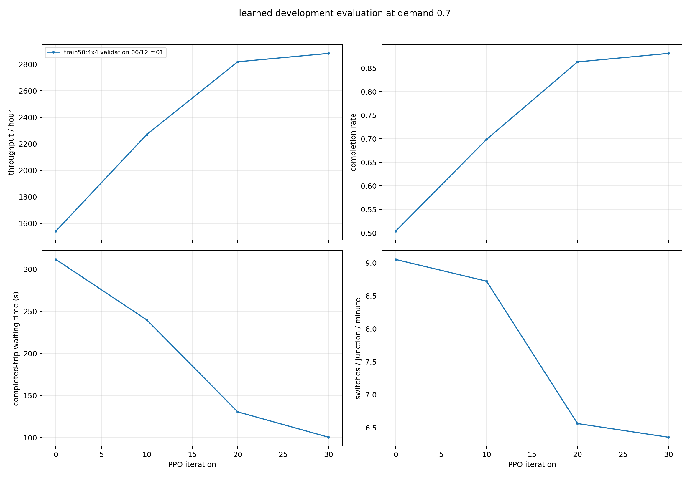
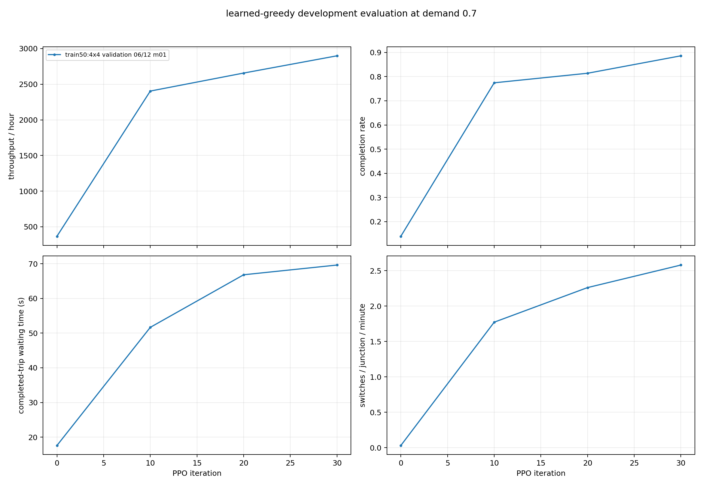
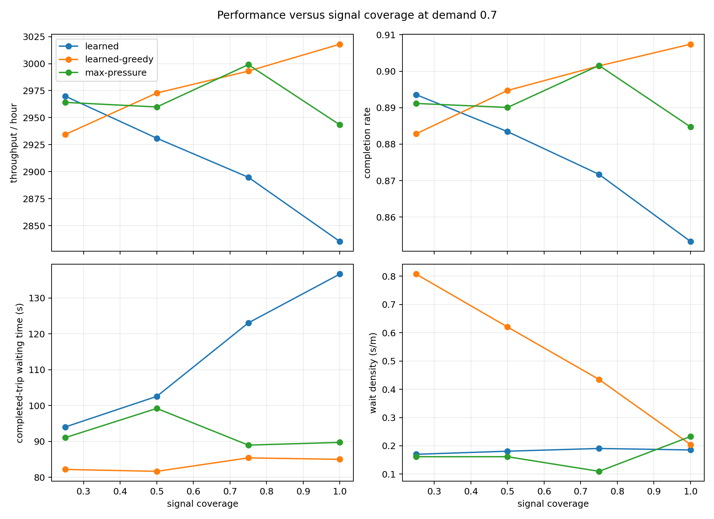

# 4x4 Signal-Coverage Generalization Study

## Result

Training on multiple 50% signal-coverage layouts solved the unfairness in the original zero-shot
coverage ablation. A two-hop PPO policy trained from scratch on five distinct 4x4 layouts with six
of twelve eligible junctions signalized generalized to fresh 25%, 50%, 75%, and 100% layouts.

The strongest conclusion is:

- greedy PPO matched max-pressure throughput and completion within paired 95% confidence intervals
  at 25%, 50%, and 75% coverage;
- sampled PPO matched max-pressure at 25% and 50%, but was materially worse at 75%;
- greedy control achieved this throughput with much lower switching, but substantially higher wait
  density on partial-coverage networks;
- sampled control maintained much better wait density, but switched more often;
- all training, validation, and final-evaluation episodes had zero teleports.

This is evidence that the graph policy can learn around unsignalized gaps when those gaps are present
during training. It is not yet a multi-seed paper result: this small study used one PPO training seed.

## Experimental design

The 4x4 generator has twelve junctions eligible for signal control. Five deterministic training masks
retained six signals each. The masks were balanced so that every eligible junction was controlled in
two or three of the five layouts. A sixth 50% mask was held out for development evaluation.

Final evaluation used fresh masks and traffic seeds:

| signal coverage | controlled junctions | layout masks | traffic seeds | episodes per policy |
| ---: | ---: | ---: | ---: | ---: |
| 25% | 3 / 12 | 5 | 3 | 15 |
| 50% | 6 / 12 | 5 | 3 | 15 |
| 75% | 9 / 12 | 5 | 3 | 15 |
| 100% | 12 / 12 | 1 | 3 | 3 |

The 50% evaluation masks were disjoint from the five training masks and the development-validation
mask. Final traffic seeds were `8401`, `8402`, and `8403`; they were not used for rollout generation
or checkpoint selection.

The exact protocol is documented in
[`grid_coverage_generalization_protocol.md`](grid_coverage_generalization_protocol.md). Training used
[`grid_coverage_generalization_4x4_train50_2hop_30.yaml`](../../configs/training/grid_coverage_generalization_4x4_train50_2hop_30.yaml),
and final evaluation used
[`grid_coverage_generalization_4x4_evaluation.yaml`](../../configs/training/grid_coverage_generalization_4x4_evaluation.yaml).

## Sample balancing

Every training layout had six controlled junctions and contributed eighteen 200-decision rollouts per
iteration. Its PPO contribution was therefore:

`18 rollouts x 200 decisions x 6 junction actions = 21,600 junction/action samples`

The five layouts contributed `108,000` junction/action samples per iteration in total. This balances
the actual units consumed by PPO rather than assuming that equal graph rollout counts imply equal
sample weight.

## Frozen scientific settings

- two message-passing hops;
- five-second decisions;
- yellow starts immediately and lasts three seconds;
- minimum green of one decision;
- 6-8% initial occupancy and a 15-second warm-up;
- training demand sampled from 0.6-0.8;
- local progress/discharge/braking-only/gridlock weights `1/10/10/0.02`;
- no global, flow, throughput, or direct switching reward;
- entropy coefficient `0.001`;
- four PPO epochs;
- 200 decisions per rollout;
- sampled and greedy learned evaluation;
- max-pressure, queue, fixed-time, and uniform-random baselines.

## Grid and demand validation

All five training masks and the development mask shared identical geometry and demand:

| quantity | value |
| --- | ---: |
| edges | 80 |
| lanes | 176 |
| lane length | 25,420.8 m |
| base demand | 3,997.44 vehicles/hour |
| requested initial vehicles | 222 |
| realized initial occupancy | 6.955% |
| warm-up | 15 seconds |
| warm-up teleports | 0 |
| evaluation teleports | 0 |

At demand `0.7`, max-pressure completion ranged from 83.7% to 90.0% across the six layouts. The
variation therefore reflects the placement of unsignalized gaps rather than a change in network
geometry, route definitions, or generated demand.

## Training trajectory

The scratch run used seed `6101` and the fixed iteration-30 checkpoint. The held-out 50% development
layout improved strongly by iteration 20 and changed only modestly between iterations 20 and 30.

| iteration | action mode | throughput / h | completion | wait density | switches / junction / min |
| ---: | --- | ---: | ---: | ---: | ---: |
| 0 | sampled | 1,542.0 | 50.4% | 0.929 | 9.05 |
| 10 | sampled | 2,270.7 | 69.9% | 0.394 | 8.72 |
| 20 | sampled | 2,818.7 | 86.3% | 0.247 | 6.56 |
| 30 | sampled | 2,882.0 | 88.1% | 0.117 | 6.36 |
| 0 | greedy | 366.7 | 13.9% | 16.393 | 0.03 |
| 10 | greedy | 2,404.0 | 77.4% | 6.294 | 1.77 |
| 20 | greedy | 2,656.7 | 81.4% | 2.703 | 2.26 |
| 30 | greedy | 2,898.7 | 88.6% | 0.768 | 2.58 |
| all | max-pressure | 2,971.3 | 90.9% | 0.075 | 4.49 |

## Final fresh-seed evaluation

The following are unpaired descriptive means across masks and final traffic seeds. Completed-trip
waiting time must be read together with completion and wait density because it excludes vehicles that
did not finish.

| coverage | policy | throughput / h | completion | completed-trip wait | switches / junction / min | wait density |
| ---: | --- | ---: | ---: | ---: | ---: | ---: |
| 25% | sampled PPO | 2,969.9 | 89.4% | 94.0 s | 5.72 | 0.170 |
| 25% | greedy PPO | 2,934.4 | 88.3% | 82.2 s | 2.23 | 0.808 |
| 25% | max-pressure | 2,964.1 | 89.1% | 91.0 s | 4.26 | 0.161 |
| 50% | sampled PPO | 2,930.9 | 88.3% | 102.6 s | 6.46 | 0.181 |
| 50% | greedy PPO | 2,972.8 | 89.5% | 81.6 s | 2.39 | 0.620 |
| 50% | max-pressure | 2,959.9 | 89.0% | 99.2 s | 4.55 | 0.161 |
| 75% | sampled PPO | 2,894.8 | 87.2% | 123.0 s | 6.82 | 0.191 |
| 75% | greedy PPO | 2,993.1 | 90.1% | 85.4 s | 2.78 | 0.435 |
| 75% | max-pressure | 2,999.1 | 90.2% | 89.0 s | 4.70 | 0.110 |
| 100% | sampled PPO | 2,835.3 | 85.3% | 136.7 s | 7.03 | 0.185 |
| 100% | greedy PPO | 3,018.0 | 90.7% | 85.0 s | 2.87 | 0.204 |
| 100% | max-pressure | 2,943.3 | 88.5% | 89.7 s | 4.96 | 0.233 |

Queue selected the same actions as max-pressure in these final episodes and therefore produced
identical aggregate metrics. The remaining baselines were:

| coverage | policy | throughput / h | completion | completed-trip wait | switches / junction / min | wait density |
| ---: | --- | ---: | ---: | ---: | ---: | ---: |
| 25% | fixed-time | 2,857.5 | 85.9% | 123.9 s | 5.97 | 0.127 |
| 25% | uniform-random | 2,744.5 | 82.9% | 145.1 s | 9.72 | 0.171 |
| 50% | fixed-time | 2,595.6 | 78.2% | 196.9 s | 5.97 | 0.209 |
| 50% | uniform-random | 2,195.5 | 67.0% | 243.9 s | 9.91 | 0.325 |
| 75% | fixed-time | 2,302.4 | 69.8% | 264.2 s | 5.97 | 0.305 |
| 75% | uniform-random | 1,768.3 | 54.8% | 315.3 s | 9.90 | 0.478 |
| 100% | fixed-time | 2,018.7 | 61.3% | 340.2 s | 5.97 | 0.505 |
| 100% | uniform-random | 1,491.3 | 47.2% | 374.1 s | 10.21 | 0.604 |

## Paired confidence intervals

Differences are PPO minus max-pressure, paired by layout mask and traffic seed. Intervals are 95%
Student-t intervals. Partial-coverage rows contain fifteen pairs; the single 100% layout contains
only three traffic-seed pairs and consequently has very wide intervals.

| coverage | action mode | throughput difference / h | completion difference | wait-density difference |
| ---: | --- | ---: | ---: | ---: |
| 25% | sampled | +5.7 +/- 52.5 | +0.24 +/- 1.54 pp | +0.009 +/- 0.078 |
| 50% | sampled | -28.9 +/- 54.1 | -0.66 +/- 1.62 pp | +0.019 +/- 0.057 |
| 75% | sampled | -104.3 +/- 41.3 | -2.99 +/- 1.21 pp | +0.081 +/- 0.041 |
| 100% | sampled | -108.0 +/- 345.2 | -3.14 +/- 10.57 pp | -0.048 +/- 0.871 |
| 25% | greedy | -29.7 +/- 47.9 | -0.83 +/- 1.49 pp | +0.646 +/- 0.143 |
| 50% | greedy | +12.9 +/- 46.8 | +0.47 +/- 1.40 pp | +0.459 +/- 0.124 |
| 75% | greedy | -6.0 +/- 36.0 | -0.01 +/- 1.03 pp | +0.325 +/- 0.100 |
| 100% | greedy | +74.7 +/- 274.1 | +2.27 +/- 8.23 pp | -0.029 +/- 0.899 |

The sampled policy is statistically indistinguishable from max-pressure on throughput, completion,
and wait density at 25% and 50%. At 75%, all three metrics are worse. The greedy policy is
indistinguishable on throughput and completion at every partial coverage, but its wait density is
materially worse. Greedy switches about two fewer times per junction per minute than max-pressure;
sampled PPO switches roughly 1.5-2.1 times more.

## Interpretation

The original full-coverage-trained policy was being asked to handle a local right-of-way condition
that did not occur in its rollout distribution. This experiment demonstrates that the limitation was
primarily distributional rather than architectural: the movement graph already propagates through
unsignalized lane-to-lane connectors, and PPO can learn useful control when those connectors and gaps
are represented during training.

Training at exactly 50% coverage did not make the sampled action distribution coverage-invariant.
The performance shift at 75% and 100% suggests that the number and arrangement of controllable
junctions still changes the learned action calibration. A stronger paper design would mix coverage
levels during training or add two more independent 50%-training seeds before making a broad
coverage-generalization claim.

## Should the city networks be retrained?

Yes, if the paper will present the current two-hop local reward as its main method.

The documented city result is not an evaluation of the current method. It used:

- one message-passing hop rather than two;
- ten-second rather than five-second decisions;
- two rather than four PPO epochs;
- 350 rather than 200 decisions per rollout;
- 5-8% rather than 6-8% initial occupancy;
- training demand around 0.8-1.2 rather than 0.6-0.8;
- global reward `0.2`, throughput reward `1.0`, progress `0.25`, gridlock `0.08`, and speed-change
  `0.005`, rather than the current local `1/10/10/0.02` reward with zero global and throughput terms.

Those changes are large enough that the old city checkpoint cannot support a claim about the revised
reward. The economical next step is one scratch city gate using the current timing, two-hop model,
reward, and PPO update settings:

1. train on the same four city networks for 30 iterations;
2. keep Freiburg as visible validation, not as an untouched test;
3. use fresh evaluation seeds and a newly held-out city for the final test;
4. extend beyond 30 only if the city validation curve is still improving;
5. run at least three independent training seeds before using the result as primary paper evidence.

City demand and occupancy should be dynamically revalidated before launch. Any city-specific demand
caps must be documented rather than silently inherited from the old configuration.

## Evidence

The complete run, checkpoint sequence, periodic evaluations, final evaluation, confidence intervals,
plots, and dynamic validation are mirrored under:

`C:\Projects\GNN-Traffic-Light-Optimization-Results\grid_coverage_generalization_4x4`

The corresponding complete artifacts remain in the remote repository under:

- `runs/rl/grid_coverage_generalization_4x4_train50_seed_6101`;
- `checkpoints/rl/grid_coverage_generalization_4x4_train50_seed_6101`;
- `reports/grid_coverage_generalization_4x4_final/train50_seed6101_iter0030_fresh8401_8403`;
- `reports/grid_coverage_generalization_4x4_analysis/train50_seed6101_iter0030_fresh8401_8403`;
- `reports/coverage_generalization_4x4_train_dynamic_validation_9201`.

## Limitations

- This small study has one independent PPO training seed.
- The 100% condition has one topology mask and only three paired episodes.
- All networks use one synthetic 4x4 geometry; this isolates signal coverage but does not test
  irregular city topology.
- Signal removal changes both controllability and local right-of-way semantics.
- The plotted coverage means are descriptive; inferential claims use the paired intervals above.

